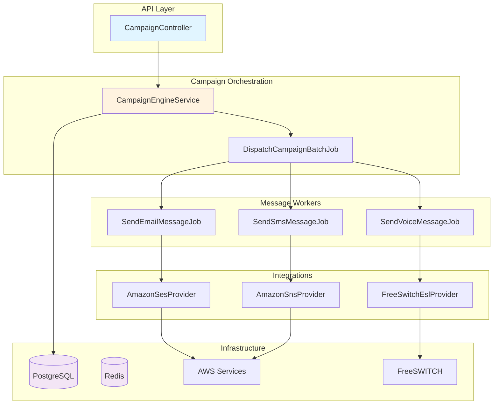
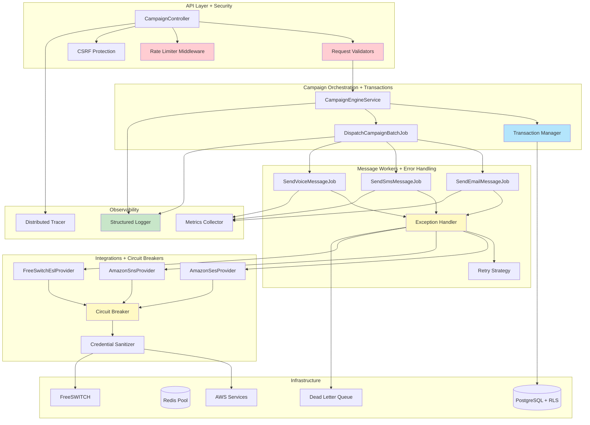

# Design Document: ContactSass Production Hardening

## Overview

This design addresses critical production-readiness gaps in the ContactSass multi-tenant SaaS platform identified during QA review. The platform handles mass Email, SMS, and Voice broadcasting campaigns using PHP 8.2 + Laravel, PostgreSQL, Redis, AWS services (SES, SNS, S3), and FreeSWITCH for voice communications.

The hardening effort focuses on seven critical areas: security vulnerabilities (credential leakage, SQL injection, missing CSRF/rate limiting), error handling gaps (unhandled exceptions in AWS/FreeSWITCH integrations), performance bottlenecks (N+1 queries, missing indexes), code quality issues (inconsistent error responses, missing logging), data integrity risks (missing transactions, race conditions), missing functionality (webhook handlers, retry strategies), and testing gaps (no unit/integration/property-based tests).

This design maintains backward compatibility with the existing database schema and API contracts while introducing defensive programming patterns, comprehensive observability, security hardening, and systematic error recovery mechanisms. The implementation follows Laravel best practices and ensures zero-downtime deployment capability through feature flags and gradual rollout strategies.

## Architecture

### Current Architecture Overview



### Enhanced Architecture with Hardening Layers



## Main Workflow: Campaign Dispatch with Error Handling

```mermaid
sequenceDiagram
    participant API as CampaignController
    participant VAL as RequestValidator
    participant ENG as CampaignEngineService
    participant DB as PostgreSQL
    participant BATCH as DispatchCampaignBatchJob
    participant WORKER as SendMessageJob
    participant CB as CircuitBreaker
    participant PROV as Provider (SES/SNS/FSW)
    participant DLQ as DeadLetterQueue
    participant LOG as StructuredLogger
    
    API->>VAL: Validate request
    VAL->>VAL: Sanitize inputs
    VAL-->>API: Validation result
    
    API->>ENG: dispatchCampaign(tenantId, campaignId)
    ENG->>LOG: Log campaign start
    ENG->>DB: BEGIN TRANSACTION
    ENG->>DB: Update campaign status to 'running'
    ENG->>DB: Query contacts with eager loading
    
    loop For each batch
        ENG->>DB: Insert campaign_batch record
        ENG->>BATCH: Dispatch batch job
        ENG->>DB: COMMIT batch
    end
    
    ENG->>DB: COMMIT TRANSACTION
    ENG->>LOG: Log campaign dispatched
    ENG-->>API: Success response
    
    BATCH->>DB: BEGIN TRANSACTION
    BATCH->>DB: Update batch status to 'running'
    
    loop For each contact
        BATCH->>DB: Insert message record
        BATCH->>WORKER: Dispatch send job
    end
    
    BATCH->>DB: COMMIT TRANSACTION
    
    WORKER->>LOG: Log message processing
    WORKER->>CB: Check circuit state
    
    alt Circuit OPEN
        CB-->>WORKER: Circuit open, fail fast
        WORKER->>DLQ: Send to dead letter queue
        WORKER->>LOG: Log circuit open
    else Circuit CLOSED
        WORKER->>PROV: send(message)
        
        alt Success
            PROV-->>WORKER: Success response
            WORKER->>DB: Update message status to 'sent'
            WORKER->>LOG: Log success
        else Provider Error
            PROV-->>WORKER: Error response
            WORKER->>CB: Record failure
            WORKER->>WORKER: Retry with backoff
            
            alt Max retries exceeded
                WORKER->>DLQ: Send to dead letter queue
                WORKER->>DB: Update message status to 'failed'
                WORKER->>LOG: Log permanent failure
            end
        end
    end

## Components and Interfaces

### 1. Security Layer Components

#### 1.1 Request Validator

**Purpose**: Sanitize and validate all incoming API requests to prevent injection attacks and ensure data integrity.

**Interface**:
```php
interface RequestValidator
{
    /**
     * Validate and sanitize campaign creation request
     * 
     * @throws ValidationException if validation fails
     */
    public function validateCampaignRequest(array $data, string $tenantId): ValidatedCampaignData;
    
    /**
     * Sanitize SQL-injectable fields
     */
    public function sanitizeSqlInput(string $input): string;
    
    /**
     * Validate contact data for bulk import
     */
    public function validateContactBatch(array $contacts, string $tenantId): array;
}
```

**Responsibilities**:
- Input sanitization for SQL injection prevention
- Type validation and coercion
- Business rule validation (e.g., email format, phone E.164 format)
- Tenant boundary enforcement
- XSS prevention in user-generated content


#### 1.2 Rate Limiter Middleware

**Purpose**: Protect API endpoints from abuse and ensure fair resource allocation across tenants.

**Interface**:
```php
interface RateLimiter
{
    /**
     * Check if request is within rate limit
     * 
     * @return bool True if allowed, false if rate limit exceeded
     */
    public function attempt(string $key, int $maxAttempts, int $decaySeconds): bool;
    
    /**
     * Get remaining attempts for a key
     */
    public function remaining(string $key, int $maxAttempts): int;
    
    /**
     * Get time until rate limit resets
     */
    public function availableIn(string $key): int;
    
    /**
     * Clear rate limit for a key
     */
    public function clear(string $key): void;
}
```

**Rate Limit Policies**:
- API endpoints: 60 requests/minute per tenant
- Campaign dispatch: 10 campaigns/minute per tenant
- Contact import: 5 imports/minute per tenant
- Webhook callbacks: 1000 requests/minute per tenant (global)


#### 1.3 Credential Sanitizer

**Purpose**: Prevent credential leakage in logs, error messages, and external communications.

**Interface**:
```php
interface CredentialSanitizer
{
    /**
     * Sanitize sensitive data from array/object before logging
     */
    public function sanitize(mixed $data): mixed;
    
    /**
     * Redact AWS credentials from exception messages
     */
    public function sanitizeException(\Throwable $exception): \Throwable;
    
    /**
     * Get list of sensitive field patterns
     */
    public function getSensitivePatterns(): array;
}
```

**Sensitive Patterns**:
- `password`, `secret`, `token`, `api_key`, `access_key`, `private_key`
- AWS credentials: `AWS_ACCESS_KEY_ID`, `AWS_SECRET_ACCESS_KEY`
- Database credentials: `DB_PASSWORD`, `REDIS_PASSWORD`
- JWT tokens and session identifiers


#### 1.4 CSRF Protection Middleware

**Purpose**: Prevent Cross-Site Request Forgery attacks on state-changing operations.

**Interface**:
```php
interface CsrfProtection
{
    /**
     * Generate CSRF token for session
     */
    public function generateToken(string $sessionId): string;
    
    /**
     * Validate CSRF token from request
     * 
     * @throws CsrfTokenMismatchException
     */
    public function validateToken(string $token, string $sessionId): void;
    
    /**
     * Check if route requires CSRF protection
     */
    public function shouldProtect(string $route, string $method): bool;
}
```

**Protected Operations**:
- Campaign creation, update, deletion
- Contact list modifications
- Tenant settings changes
- User role assignments


### 2. Error Handling Components

#### 2.1 Exception Handler

**Purpose**: Centralized exception handling with proper logging, sanitization, and recovery strategies.

**Interface**:
```php
interface ExceptionHandler
{
    /**
     * Handle exception with context-aware recovery
     * 
     * @return HandlerResult Contains recovery action and sanitized error
     */
    public function handle(\Throwable $exception, array $context): HandlerResult;
    
    /**
     * Determine if exception is retryable
     */
    public function isRetryable(\Throwable $exception): bool;
    
    /**
     * Get retry delay for exception type
     */
    public function getRetryDelay(\Throwable $exception, int $attempt): int;
    
    /**
     * Convert exception to user-facing error response
     */
    public function toErrorResponse(\Throwable $exception): array;
}
```

**Exception Categories**:
- **Retryable**: Network timeouts, rate limits, temporary AWS errors
- **Non-retryable**: Validation errors, authentication failures, malformed data
- **Critical**: Database connection loss, Redis unavailable, provider account suspended


#### 2.2 Retry Strategy

**Purpose**: Implement exponential backoff with jitter for failed operations.

**Interface**:
```php
interface RetryStrategy
{
    /**
     * Execute operation with retry logic
     * 
     * @template T
     * @param callable(): T $operation
     * @return T
     * @throws MaxRetriesExceededException
     */
    public function execute(callable $operation, RetryConfig $config): mixed;
    
    /**
     * Calculate backoff delay with jitter
     */
    public function calculateDelay(int $attempt, int $baseDelay, int $maxDelay): int;
    
    /**
     * Check if should retry based on exception
     */
    public function shouldRetry(\Throwable $exception, int $attempt, int $maxAttempts): bool;
}
```

**Retry Configuration**:
```php
class RetryConfig
{
    public function __construct(
        public int $maxAttempts = 3,
        public int $baseDelayMs = 1000,
        public int $maxDelayMs = 30000,
        public float $jitterFactor = 0.1,
        public array $retryableExceptions = []
    ) {}
}
```


#### 2.3 Circuit Breaker

**Purpose**: Prevent cascading failures by failing fast when downstream services are unhealthy.

**Interface**:
```php
interface CircuitBreaker
{
    /**
     * Execute operation through circuit breaker
     * 
     * @template T
     * @param callable(): T $operation
     * @return T
     * @throws CircuitOpenException
     */
    public function call(string $serviceName, callable $operation): mixed;
    
    /**
     * Record successful operation
     */
    public function recordSuccess(string $serviceName): void;
    
    /**
     * Record failed operation
     */
    public function recordFailure(string $serviceName): void;
    
    /**
     * Get current circuit state
     * 
     * @return CircuitState CLOSED, OPEN, or HALF_OPEN
     */
    public function getState(string $serviceName): CircuitState;
    
    /**
     * Manually reset circuit
     */
    public function reset(string $serviceName): void;
}
```

**Circuit States**:
- **CLOSED**: Normal operation, requests pass through
- **OPEN**: Too many failures, requests fail immediately
- **HALF_OPEN**: Testing if service recovered, limited requests allowed

**Thresholds**:
- Failure threshold: 5 failures in 60 seconds → OPEN
- Half-open timeout: 30 seconds
- Success threshold in half-open: 2 consecutive successes → CLOSED


### 3. Transaction Management Components

#### 3.1 Transaction Manager

**Purpose**: Ensure ACID properties for multi-step operations and prevent data inconsistencies.

**Interface**:
```php
interface TransactionManager
{
    /**
     * Execute operation within database transaction
     * 
     * @template T
     * @param callable(): T $operation
     * @return T
     * @throws TransactionException
     */
    public function transaction(callable $operation): mixed;
    
    /**
     * Execute with distributed lock
     * 
     * @template T
     * @param callable(): T $operation
     */
    public function withLock(string $lockKey, callable $operation, int $timeoutSeconds = 10): mixed;
    
    /**
     * Check if currently in transaction
     */
    public function inTransaction(): bool;
    
    /**
     * Get current transaction level (for nested transactions)
     */
    public function transactionLevel(): int;
}
```

**Critical Transactional Operations**:
- Campaign dispatch: Update campaign status + create batches atomically
- Batch processing: Update batch status + create messages atomically
- Message state transitions: Update message + create delivery event atomically
- Usage recording: Update message + create usage record atomically


#### 3.2 Distributed Lock Manager

**Purpose**: Prevent race conditions in distributed worker environments.

**Interface**:
```php
interface DistributedLock
{
    /**
     * Acquire lock with timeout
     * 
     * @return bool True if lock acquired, false if timeout
     */
    public function acquire(string $key, int $ttlSeconds, int $timeoutSeconds = 0): bool;
    
    /**
     * Release lock
     */
    public function release(string $key): void;
    
    /**
     * Extend lock TTL
     */
    public function extend(string $key, int $additionalSeconds): bool;
    
    /**
     * Check if lock is held
     */
    public function isLocked(string $key): bool;
}
```

**Lock Patterns**:
- Campaign dispatch: `campaign:dispatch:{campaign_id}` - Prevent duplicate dispatch
- Batch processing: `batch:process:{batch_id}` - Prevent duplicate batch execution
- Usage aggregation: `usage:aggregate:{tenant_id}:{date}` - Prevent concurrent aggregation
- Rate limit enforcement: `ratelimit:{tenant_id}:{metric}` - Atomic counter updates


### 4. Observability Components

#### 4.1 Structured Logger

**Purpose**: Provide consistent, searchable, and context-rich logging across all components.

**Interface**:
```php
interface StructuredLogger
{
    /**
     * Log with structured context
     */
    public function log(string $level, string $message, array $context = []): void;
    
    /**
     * Log campaign lifecycle event
     */
    public function logCampaignEvent(string $event, string $campaignId, array $context = []): void;
    
    /**
     * Log message processing event
     */
    public function logMessageEvent(string $event, string $messageId, array $context = []): void;
    
    /**
     * Log provider interaction
     */
    public function logProviderCall(string $provider, string $operation, array $context = []): void;
    
    /**
     * Log security event
     */
    public function logSecurityEvent(string $event, string $severity, array $context = []): void;
}
```

**Standard Context Fields**:
- `tenant_id`: Tenant identifier for filtering
- `campaign_id`: Campaign identifier
- `message_id`: Message identifier
- `batch_id`: Batch identifier
- `channel`: Communication channel (email/sms/voice)
- `user_id`: User who initiated action
- `request_id`: Unique request identifier for tracing
- `duration_ms`: Operation duration
- `error_code`: Error code if applicable


#### 4.2 Metrics Collector

**Purpose**: Collect and expose operational metrics for monitoring and alerting.

**Interface**:
```php
interface MetricsCollector
{
    /**
     * Increment counter metric
     */
    public function increment(string $metric, array $tags = [], int $value = 1): void;
    
    /**
     * Record gauge value
     */
    public function gauge(string $metric, float $value, array $tags = []): void;
    
    /**
     * Record histogram value (for latencies)
     */
    public function histogram(string $metric, float $value, array $tags = []): void;
    
    /**
     * Time operation execution
     * 
     * @template T
     * @param callable(): T $operation
     * @return T
     */
    public function time(string $metric, callable $operation, array $tags = []): mixed;
}
```

**Key Metrics**:
- `campaigns.dispatched` (counter): Campaigns started
- `messages.sent` (counter): Messages successfully sent, tagged by channel
- `messages.failed` (counter): Messages failed, tagged by channel and error_type
- `provider.latency` (histogram): Provider API call duration
- `queue.depth` (gauge): Current queue depth by queue name
- `circuit_breaker.state` (gauge): Circuit breaker state (0=closed, 1=open, 2=half-open)
- `rate_limit.exceeded` (counter): Rate limit violations by tenant
- `database.query_time` (histogram): Database query duration


#### 4.3 Distributed Tracer

**Purpose**: Track request flow across services and identify performance bottlenecks.

**Interface**:
```php
interface DistributedTracer
{
    /**
     * Start new trace span
     */
    public function startSpan(string $operationName, array $tags = []): Span;
    
    /**
     * Get current active span
     */
    public function activeSpan(): ?Span;
    
    /**
     * Inject trace context into carrier (for propagation)
     */
    public function inject(Span $span, array &$carrier): void;
    
    /**
     * Extract trace context from carrier
     */
    public function extract(array $carrier): ?SpanContext;
}

interface Span
{
    public function setTag(string $key, mixed $value): self;
    public function log(array $data): self;
    public function finish(): void;
    public function getContext(): SpanContext;
}
```

**Trace Points**:
- API request entry
- Campaign dispatch start/end
- Batch processing start/end
- Message send start/end
- Provider API call start/end
- Database query execution
- Redis operations


### 5. Performance Optimization Components

#### 5.1 Query Optimizer

**Purpose**: Eliminate N+1 queries and ensure efficient database access patterns.

**Interface**:
```php
interface QueryOptimizer
{
    /**
     * Load campaign with all required relationships
     */
    public function loadCampaignWithRelations(string $campaignId): Campaign;
    
    /**
     * Batch load contacts for multiple messages
     */
    public function batchLoadContacts(array $contactIds): Collection;
    
    /**
     * Get campaign statistics with single query
     */
    public function getCampaignStats(string $campaignId): CampaignStats;
    
    /**
     * Analyze query and suggest optimizations
     */
    public function analyzeQuery(string $sql): QueryAnalysis;
}
```

**Optimization Strategies**:
- Eager loading: Use `with()` for relationships to prevent N+1
- Batch loading: Load multiple records in single query
- Select specific columns: Avoid `SELECT *` when not needed
- Index hints: Use appropriate indexes for large tables
- Query result caching: Cache frequently accessed data


#### 5.2 Database Index Manager

**Purpose**: Ensure optimal indexes exist for query patterns.

**Required Indexes**:
```sql
-- Campaign queries
CREATE INDEX idx_campaigns_tenant_status_created ON campaigns (tenant_id, status, created_at DESC);
CREATE INDEX idx_campaigns_scheduled_at ON campaigns (scheduled_at) WHERE status = 'scheduled';

-- Message queries
CREATE INDEX idx_messages_campaign_status_created ON messages (campaign_id, status, created_at DESC);
CREATE INDEX idx_messages_tenant_channel_status ON messages (tenant_id, channel, status);
CREATE INDEX idx_messages_queued_at ON messages (queued_at) WHERE status = 'queued';

-- Contact queries
CREATE INDEX idx_contacts_tenant_created ON contacts (tenant_id, created_at DESC);
CREATE INDEX idx_contacts_email_gin ON contacts USING gin (email gin_trgm_ops);
CREATE INDEX idx_contacts_phone_gin ON contacts USING gin (phone_e164 gin_trgm_ops);

-- Delivery events
CREATE INDEX idx_delivery_events_message_occurred ON delivery_events (message_id, occurred_at DESC);
CREATE INDEX idx_delivery_events_tenant_type_occurred ON delivery_events (tenant_id, event_type, occurred_at DESC);

-- Usage records
CREATE INDEX idx_usage_records_tenant_recorded ON usage_records (tenant_id, recorded_at DESC);
CREATE INDEX idx_usage_records_campaign_metric ON usage_records (campaign_id, metric);

-- Batch queries
CREATE INDEX idx_campaign_batches_campaign_status ON campaign_batches (campaign_id, status);
```


### 6. Webhook and Event Processing Components

#### 6.1 Webhook Handler

**Purpose**: Process incoming webhooks from providers (SES, SNS, FreeSWITCH) with validation and idempotency.

**Interface**:
```php
interface WebhookHandler
{
    /**
     * Process incoming webhook
     * 
     * @throws WebhookValidationException
     */
    public function handle(string $provider, array $payload, array $headers): WebhookResult;
    
    /**
     * Validate webhook signature
     */
    public function validateSignature(string $provider, array $payload, array $headers): bool;
    
    /**
     * Check if webhook already processed (idempotency)
     */
    public function isProcessed(string $webhookId): bool;
    
    /**
     * Mark webhook as processed
     */
    public function markProcessed(string $webhookId, array $result): void;
}
```

**Webhook Types**:
- **SES**: Bounce, complaint, delivery notifications
- **SNS**: SMS delivery receipts, opt-out notifications
- **FreeSWITCH**: Call status updates, recording URLs


#### 6.2 Dead Letter Queue Handler

**Purpose**: Process and retry messages that failed permanently.

**Interface**:
```php
interface DeadLetterQueueHandler
{
    /**
     * Send message to DLQ
     */
    public function send(string $messageId, \Throwable $exception, array $context): void;
    
    /**
     * Retrieve messages from DLQ for analysis
     */
    public function retrieve(int $limit = 100): array;
    
    /**
     * Retry message from DLQ
     */
    public function retry(string $dlqEntryId): void;
    
    /**
     * Archive message (permanent failure)
     */
    public function archive(string $dlqEntryId, string $reason): void;
    
    /**
     * Get DLQ statistics
     */
    public function getStats(): DlqStats;
}
```

**DLQ Entry Schema**:
```php
class DlqEntry
{
    public string $id;
    public string $messageId;
    public string $tenantId;
    public string $campaignId;
    public string $channel;
    public array $payload;
    public string $errorType;
    public string $errorMessage;
    public string $stackTrace;
    public int $attemptCount;
    public \DateTimeImmutable $failedAt;
    public ?string $archivedReason;
}
```


## Data Models and Schemas

### Enhanced Campaign Model

```php
class Campaign
{
    public string $id;
    public string $tenantId;
    public string $createdBy;
    public string $name;
    public CampaignChannel $channel;
    public CampaignStatus $status;
    public string $contactListId;
    public ?string $subject;
    public ?string $templateBody;
    public ?string $smsBody;
    public ?string $voiceAudioS3Key;
    public ?\DateTimeImmutable $scheduledAt;
    public ?\DateTimeImmutable $startedAt;
    public ?\DateTimeImmutable $completedAt;
    public array $metadata;
    public \DateTimeImmutable $createdAt;
    public \DateTimeImmutable $updatedAt;
    
    // Computed properties
    public int $totalRecipients;
    public int $sentCount;
    public int $failedCount;
    public float $successRate;
}
```

**Validation Rules**:
- `name`: Required, 1-255 characters, no SQL injection patterns
- `channel`: Must be valid enum value (email, sms, voice)
- `contactListId`: Must exist and belong to tenant
- `subject`: Required for email, max 255 characters
- `smsBody`: Required for SMS, max 1600 characters (10 segments)
- `voiceAudioS3Key`: Required for voice, must be valid S3 key
- `scheduledAt`: Must be future timestamp if provided


### Enhanced Message Model

```php
class Message
{
    public string $id;
    public string $tenantId;
    public string $campaignId;
    public ?string $batchId;
    public string $contactId;
    public MessageChannel $channel;
    public ?string $providerMessageId;
    public string $messageUuid; // Idempotency key
    public MessageStatus $status;
    public ?string $errorCode;
    public ?string $errorMessage;
    public array $payload;
    public \DateTimeImmutable $queuedAt;
    public ?\DateTimeImmutable $sentAt;
    public \DateTimeImmutable $createdAt;
    public \DateTimeImmutable $updatedAt;
    
    // Relationships
    public Contact $contact;
    public Campaign $campaign;
    public Collection $deliveryEvents;
}
```

**State Transitions**:
```
queued → sending → sent (success)
queued → sending → failed (permanent failure)
queued → sending → queued (retry)
```

**Invariants**:
- `messageUuid` must be unique (idempotency)
- `status` transitions must be valid
- `sentAt` must be set when status = 'sent'
- `errorCode` and `errorMessage` must be set when status = 'failed'
- `providerMessageId` must be set when status = 'sent'


### Circuit Breaker State Model

```php
class CircuitBreakerState
{
    public string $serviceName;
    public CircuitState $state; // CLOSED, OPEN, HALF_OPEN
    public int $failureCount;
    public int $successCount;
    public ?\DateTimeImmutable $lastFailureAt;
    public ?\DateTimeImmutable $openedAt;
    public ?\DateTimeImmutable $lastStateChangeAt;
    
    // Configuration
    public int $failureThreshold = 5;
    public int $successThreshold = 2;
    public int $timeoutSeconds = 60;
    public int $halfOpenTimeoutSeconds = 30;
}
```

**State Transition Rules**:
```
CLOSED → OPEN: When failureCount >= failureThreshold within timeoutSeconds
OPEN → HALF_OPEN: After halfOpenTimeoutSeconds elapsed
HALF_OPEN → CLOSED: When successCount >= successThreshold
HALF_OPEN → OPEN: On any failure
```


### Rate Limit State Model

```php
class RateLimitState
{
    public string $key; // tenant_id:metric or global:endpoint
    public int $currentCount;
    public int $maxAttempts;
    public \DateTimeImmutable $windowStart;
    public int $windowSeconds;
    
    public function isExceeded(): bool
    {
        return $this->currentCount >= $this->maxAttempts;
    }
    
    public function remaining(): int
    {
        return max(0, $this->maxAttempts - $this->currentCount);
    }
    
    public function resetsAt(): \DateTimeImmutable
    {
        return $this->windowStart->modify("+{$this->windowSeconds} seconds");
    }
}
```


## Correctness Properties

### Universal Invariants

**Property 1: Tenant Isolation**
```
∀ operation, tenant_id₁, tenant_id₂:
  tenant_id₁ ≠ tenant_id₂ ⟹ 
    operation(tenant_id₁) cannot access data belonging to tenant_id₂
```

**Property 2: Message Idempotency**
```
∀ message_uuid:
  send(message_uuid) executed n times ⟹ 
    exactly 1 message sent to provider
```

**Property 3: Campaign State Consistency**
```
∀ campaign:
  campaign.status = 'completed' ⟹
    (campaign.sentCount + campaign.failedCount) = campaign.totalRecipients
```

**Property 4: Transaction Atomicity**
```
∀ transaction T containing operations [op₁, op₂, ..., opₙ]:
  T succeeds ⟹ all operations committed
  T fails ⟹ all operations rolled back
```

**Property 5: Rate Limit Enforcement**
```
∀ tenant, metric, window:
  count(operations(tenant, metric, window)) ≤ limit(tenant, metric)
```


### Security Properties

**Property 6: No Credential Leakage**
```
∀ log_entry, exception, response:
  sensitive_patterns ∩ content(log_entry, exception, response) = ∅
```

**Property 7: SQL Injection Prevention**
```
∀ user_input, query:
  query contains user_input ⟹ 
    user_input is parameterized OR sanitized
```

**Property 8: CSRF Protection**
```
∀ state_changing_request:
  request.method ∈ {POST, PUT, DELETE, PATCH} ⟹
    valid_csrf_token(request) = true
```

**Property 9: Authentication Required**
```
∀ protected_endpoint, request:
  access(protected_endpoint, request) ⟹
    authenticated(request) ∧ authorized(request)
```


### Error Handling Properties

**Property 10: Retry Idempotency**
```
∀ operation, n:
  retry(operation, n) ⟹
    side_effects(operation) occur exactly once
```

**Property 11: Circuit Breaker Fail-Fast**
```
∀ service, circuit_state:
  circuit_state(service) = OPEN ⟹
    call(service) fails immediately without attempting
```

**Property 12: Exception Sanitization**
```
∀ exception thrown:
  user_facing_error(exception) contains no sensitive data
```

**Property 13: Dead Letter Queue Preservation**
```
∀ message, max_retries:
  retry_count(message) ≥ max_retries ⟹
    message ∈ dead_letter_queue
```


### Performance Properties

**Property 14: Query Efficiency**
```
∀ query loading n related records:
  database_queries(query) = O(1), not O(n)
```

**Property 15: Index Coverage**
```
∀ frequent_query:
  ∃ index covering query's WHERE and ORDER BY clauses
```

**Property 16: Connection Pool Limits**
```
∀ time t:
  active_connections(database, t) ≤ max_pool_size
```


## Implementation Algorithms

### Algorithm 1: Campaign Dispatch with Transactions

```pascal
ALGORITHM dispatchCampaign(tenantId, campaignId, batchSize)
INPUT: tenantId (UUID), campaignId (UUID), batchSize (integer)
OUTPUT: void
PRECONDITIONS:
  - campaign exists and belongs to tenantId
  - campaign.status = 'draft' OR 'scheduled'
  - contactList has at least 1 contact
POSTCONDITIONS:
  - campaign.status = 'running'
  - campaign.startedAt is set
  - All batches created and queued
  - No partial state on failure

BEGIN
  ACQUIRE_LOCK("campaign:dispatch:" + campaignId, timeout=10s)
  
  BEGIN_TRANSACTION
    campaign ← SELECT * FROM campaigns 
                WHERE id = campaignId AND tenant_id = tenantId
                FOR UPDATE
    
    IF campaign IS NULL THEN
      ROLLBACK
      THROW CampaignNotFoundException
    END IF
    
    IF campaign.status NOT IN ('draft', 'scheduled') THEN
      ROLLBACK
      THROW InvalidCampaignStateException
    END IF
    
    UPDATE campaigns 
    SET status = 'running', started_at = NOW(), updated_at = NOW()
    WHERE id = campaignId
    
    totalContacts ← COUNT contacts in campaign.contactListId
    batchNumber ← 1
    
    FOR EACH batch OF contacts FROM contactList SIZE batchSize DO
      batchId ← GENERATE_UUID()
      
      INSERT INTO campaign_batches (
        id, campaign_id, batch_number, total_recipients, 
        status, created_at
      ) VALUES (
        batchId, campaignId, batchNumber, SIZE(batch),
        'queued', NOW()
      )
      
      DISPATCH_JOB(DispatchCampaignBatchJob, {
        tenantId: tenantId,
        campaignId: campaignId,
        batchId: batchId,
        batchNumber: batchNumber,
        channel: campaign.channel,
        contactIds: batch
      }) TO QUEUE 'campaign-batch'
      
      LOG_INFO("Batch dispatched", {
        campaign_id: campaignId,
        batch_id: batchId,
        batch_number: batchNumber,
        recipient_count: SIZE(batch)
      })
      
      batchNumber ← batchNumber + 1
    END FOR
    
  COMMIT_TRANSACTION
  
  RELEASE_LOCK("campaign:dispatch:" + campaignId)
  
  LOG_INFO("Campaign dispatched", {
    campaign_id: campaignId,
    total_batches: batchNumber - 1,
    total_recipients: totalContacts
  })
  
  EMIT_METRIC("campaigns.dispatched", tags={channel: campaign.channel})
  
EXCEPTION
  WHEN ANY ERROR THEN
    ROLLBACK_TRANSACTION
    RELEASE_LOCK("campaign:dispatch:" + campaignId)
    LOG_ERROR("Campaign dispatch failed", {
      campaign_id: campaignId,
      error: ERROR.message
    })
    RETHROW
END
```


### Algorithm 2: Message Send with Circuit Breaker and Retry

```pascal
ALGORITHM sendMessage(message, provider, retryConfig)
INPUT: message (Message), provider (ChannelProvider), retryConfig (RetryConfig)
OUTPUT: SendResult
PRECONDITIONS:
  - message.status = 'queued'
  - message.messageUuid is unique
  - provider is configured
POSTCONDITIONS:
  - message.status ∈ {'sent', 'failed'}
  - If sent: message.providerMessageId is set
  - If failed: message.errorCode and errorMessage are set
  - Exactly one send attempt to provider (idempotent)

BEGIN
  startTime ← NOW()
  attempt ← 0
  serviceName ← provider.getName()
  
  LOG_INFO("Message processing started", {
    message_id: message.id,
    message_uuid: message.messageUuid,
    channel: message.channel
  })
  
  WHILE attempt < retryConfig.maxAttempts DO
    attempt ← attempt + 1
    
    TRY
      // Check circuit breaker state
      circuitState ← CIRCUIT_BREAKER.getState(serviceName)
      
      IF circuitState = OPEN THEN
        LOG_WARN("Circuit breaker open", {
          message_id: message.id,
          service: serviceName
        })
        
        IF attempt >= retryConfig.maxAttempts THEN
          SEND_TO_DLQ(message, CircuitOpenException)
          UPDATE_MESSAGE_STATUS(message.id, 'failed', 
            'CIRCUIT_OPEN', 'Circuit breaker open')
          RETURN SendResult.Failed
        END IF
        
        SLEEP(retryConfig.baseDelayMs * attempt)
        CONTINUE
      END IF
      
      // Attempt to send through provider
      SPAN ← START_TRACE_SPAN("provider.send", {
        provider: serviceName,
        channel: message.channel
      })
      
      result ← provider.send(message)
      
      SPAN.finish()
      
      // Success path
      CIRCUIT_BREAKER.recordSuccess(serviceName)
      
      UPDATE_MESSAGE_STATUS(
        message.id, 
        'sent',
        null,
        null,
        result.providerMessageId,
        NOW()
      )
      
      CREATE_DELIVERY_EVENT(
        message.id,
        'sent',
        result.providerMessageId
      )
      
      duration ← NOW() - startTime
      LOG_INFO("Message sent successfully", {
        message_id: message.id,
        provider_message_id: result.providerMessageId,
        duration_ms: duration,
        attempt: attempt
      })
      
      EMIT_METRIC("messages.sent", tags={
        channel: message.channel,
        attempt: attempt
      })
      
      EMIT_METRIC("provider.latency", duration, tags={
        provider: serviceName
      })
      
      RETURN SendResult.Success(result.providerMessageId)
      
    CATCH ProviderException AS e THEN
      CIRCUIT_BREAKER.recordFailure(serviceName)
      
      isRetryable ← EXCEPTION_HANDLER.isRetryable(e)
      
      LOG_WARN("Provider error", {
        message_id: message.id,
        error_type: e.type,
        error_message: SANITIZE(e.message),
        attempt: attempt,
        retryable: isRetryable
      })
      
      IF NOT isRetryable OR attempt >= retryConfig.maxAttempts THEN
        // Permanent failure
        SEND_TO_DLQ(message, e)
        
        UPDATE_MESSAGE_STATUS(
          message.id,
          'failed',
          e.errorCode,
          SANITIZE(e.message)
        )
        
        EMIT_METRIC("messages.failed", tags={
          channel: message.channel,
          error_type: e.errorCode
        })
        
        RETURN SendResult.Failed
      END IF
      
      // Calculate backoff delay with jitter
      delay ← CALCULATE_BACKOFF(
        attempt,
        retryConfig.baseDelayMs,
        retryConfig.maxDelayMs,
        retryConfig.jitterFactor
      )
      
      LOG_INFO("Retrying message", {
        message_id: message.id,
        attempt: attempt,
        delay_ms: delay
      })
      
      SLEEP(delay)
    END TRY
  END WHILE
  
  // Should not reach here, but handle as safety
  SEND_TO_DLQ(message, MaxRetriesExceededException)
  UPDATE_MESSAGE_STATUS(message.id, 'failed', 
    'MAX_RETRIES', 'Maximum retry attempts exceeded')
  RETURN SendResult.Failed
END
```


### Algorithm 3: Circuit Breaker State Management

```pascal
ALGORITHM circuitBreakerCall(serviceName, operation)
INPUT: serviceName (string), operation (callable)
OUTPUT: result of operation
PRECONDITIONS:
  - serviceName is registered
  - operation is callable
POSTCONDITIONS:
  - Circuit state updated based on result
  - Metrics recorded

BEGIN
  state ← GET_CIRCUIT_STATE(serviceName)
  
  IF state.state = OPEN THEN
    elapsed ← NOW() - state.openedAt
    
    IF elapsed >= state.halfOpenTimeoutSeconds THEN
      // Transition to HALF_OPEN
      TRANSITION_STATE(serviceName, HALF_OPEN)
      state.state ← HALF_OPEN
      state.successCount ← 0
      state.failureCount ← 0
    ELSE
      // Fail fast
      EMIT_METRIC("circuit_breaker.rejected", tags={
        service: serviceName
      })
      THROW CircuitOpenException("Circuit breaker is OPEN for " + serviceName)
    END IF
  END IF
  
  TRY
    result ← operation()
    
    // Success handling
    IF state.state = HALF_OPEN THEN
      state.successCount ← state.successCount + 1
      
      IF state.successCount >= state.successThreshold THEN
        // Transition to CLOSED
        TRANSITION_STATE(serviceName, CLOSED)
        state.state ← CLOSED
        state.failureCount ← 0
        state.successCount ← 0
        
        LOG_INFO("Circuit breaker closed", {
          service: serviceName
        })
      END IF
    ELSE IF state.state = CLOSED THEN
      // Reset failure count on success
      state.failureCount ← 0
      state.lastFailureAt ← NULL
    END IF
    
    SAVE_CIRCUIT_STATE(serviceName, state)
    EMIT_METRIC("circuit_breaker.state", STATE_TO_INT(state.state), 
      tags={service: serviceName})
    
    RETURN result
    
  CATCH Exception AS e THEN
    // Failure handling
    state.failureCount ← state.failureCount + 1
    state.lastFailureAt ← NOW()
    
    IF state.state = HALF_OPEN THEN
      // Transition back to OPEN
      TRANSITION_STATE(serviceName, OPEN)
      state.state ← OPEN
      state.openedAt ← NOW()
      state.successCount ← 0
      
      LOG_WARN("Circuit breaker reopened", {
        service: serviceName
      })
    ELSE IF state.state = CLOSED THEN
      // Check if should open
      windowStart ← NOW() - state.timeoutSeconds
      recentFailures ← COUNT_FAILURES_SINCE(serviceName, windowStart)
      
      IF recentFailures >= state.failureThreshold THEN
        // Transition to OPEN
        TRANSITION_STATE(serviceName, OPEN)
        state.state ← OPEN
        state.openedAt ← NOW()
        
        LOG_WARN("Circuit breaker opened", {
          service: serviceName,
          failure_count: recentFailures
        })
      END IF
    END IF
    
    SAVE_CIRCUIT_STATE(serviceName, state)
    EMIT_METRIC("circuit_breaker.state", STATE_TO_INT(state.state),
      tags={service: serviceName})
    
    RETHROW e
  END TRY
END

FUNCTION STATE_TO_INT(state)
  IF state = CLOSED THEN RETURN 0
  IF state = OPEN THEN RETURN 1
  IF state = HALF_OPEN THEN RETURN 2
END
```


### Algorithm 4: Rate Limiting with Token Bucket

```pascal
ALGORITHM attemptRateLimit(key, maxAttempts, windowSeconds)
INPUT: key (string), maxAttempts (integer), windowSeconds (integer)
OUTPUT: boolean (true if allowed, false if exceeded)
PRECONDITIONS:
  - key is non-empty
  - maxAttempts > 0
  - windowSeconds > 0
POSTCONDITIONS:
  - If allowed: counter incremented
  - If exceeded: counter unchanged
  - State persisted in Redis

BEGIN
  redisKey ← "ratelimit:" + key
  now ← UNIX_TIMESTAMP(NOW())
  windowStart ← now - windowSeconds
  
  // Use Redis transaction for atomicity
  REDIS_MULTI()
  
  // Remove expired entries
  REDIS_ZREMRANGEBYSCORE(redisKey, 0, windowStart)
  
  // Count current attempts in window
  currentCount ← REDIS_ZCARD(redisKey)
  
  IF currentCount >= maxAttempts THEN
    REDIS_DISCARD()
    
    LOG_WARN("Rate limit exceeded", {
      key: key,
      current: currentCount,
      limit: maxAttempts
    })
    
    EMIT_METRIC("rate_limit.exceeded", tags={
      key: key
    })
    
    RETURN false
  END IF
  
  // Add current attempt
  attemptId ← GENERATE_UUID()
  REDIS_ZADD(redisKey, now, attemptId)
  
  // Set expiration on key
  REDIS_EXPIRE(redisKey, windowSeconds + 60)
  
  REDIS_EXEC()
  
  remaining ← maxAttempts - currentCount - 1
  
  LOG_DEBUG("Rate limit check passed", {
    key: key,
    remaining: remaining,
    limit: maxAttempts
  })
  
  RETURN true
END

ALGORITHM getRateLimitRemaining(key, maxAttempts, windowSeconds)
INPUT: key (string), maxAttempts (integer), windowSeconds (integer)
OUTPUT: integer (remaining attempts)

BEGIN
  redisKey ← "ratelimit:" + key
  now ← UNIX_TIMESTAMP(NOW())
  windowStart ← now - windowSeconds
  
  REDIS_ZREMRANGEBYSCORE(redisKey, 0, windowStart)
  currentCount ← REDIS_ZCARD(redisKey)
  
  remaining ← MAX(0, maxAttempts - currentCount)
  RETURN remaining
END
```


### Algorithm 5: Webhook Processing with Idempotency

```pascal
ALGORITHM processWebhook(provider, payload, headers)
INPUT: provider (string), payload (array), headers (array)
OUTPUT: WebhookResult
PRECONDITIONS:
  - provider ∈ {'ses', 'sns', 'freeswitch'}
  - payload is valid JSON
POSTCONDITIONS:
  - Webhook processed exactly once
  - Message status updated if applicable
  - Delivery event created

BEGIN
  startTime ← NOW()
  
  // Extract webhook ID for idempotency
  webhookId ← EXTRACT_WEBHOOK_ID(provider, payload)
  
  IF webhookId IS NULL THEN
    LOG_ERROR("Missing webhook ID", {
      provider: provider
    })
    RETURN WebhookResult.Invalid("Missing webhook ID")
  END IF
  
  // Check idempotency
  IF IS_WEBHOOK_PROCESSED(webhookId) THEN
    LOG_INFO("Webhook already processed", {
      webhook_id: webhookId,
      provider: provider
    })
    RETURN WebhookResult.Duplicate
  END IF
  
  // Validate signature
  IF NOT VALIDATE_SIGNATURE(provider, payload, headers) THEN
    LOG_WARN("Invalid webhook signature", {
      webhook_id: webhookId,
      provider: provider
    })
    
    EMIT_METRIC("webhook.invalid_signature", tags={
      provider: provider
    })
    
    RETURN WebhookResult.InvalidSignature
  END IF
  
  BEGIN_TRANSACTION
    // Parse webhook based on provider
    event ← PARSE_WEBHOOK_EVENT(provider, payload)
    
    IF event.messageId IS NOT NULL THEN
      // Find message by provider message ID
      message ← SELECT * FROM messages 
                WHERE provider_message_id = event.messageId
                FOR UPDATE
      
      IF message IS NOT NULL THEN
        // Update message status based on event type
        newStatus ← MAP_EVENT_TO_STATUS(event.type)
        
        IF newStatus IS NOT NULL THEN
          UPDATE messages
          SET status = newStatus,
              updated_at = NOW()
          WHERE id = message.id
        END IF
        
        // Create delivery event
        INSERT INTO delivery_events (
          tenant_id, message_id, channel, event_type,
          provider_event_id, event_payload, occurred_at, created_at
        ) VALUES (
          message.tenantId, message.id, message.channel, event.type,
          event.providerEventId, event.payload, event.occurredAt, NOW()
        )
        
        LOG_INFO("Delivery event created", {
          message_id: message.id,
          event_type: event.type,
          webhook_id: webhookId
        })
      ELSE
        LOG_WARN("Message not found for webhook", {
          provider_message_id: event.messageId,
          webhook_id: webhookId
        })
      END IF
    END IF
    
    // Mark webhook as processed
    INSERT INTO processed_webhooks (
      webhook_id, provider, processed_at, payload
    ) VALUES (
      webhookId, provider, NOW(), payload
    )
    
  COMMIT_TRANSACTION
  
  duration ← NOW() - startTime
  
  EMIT_METRIC("webhook.processed", tags={
    provider: provider,
    event_type: event.type
  })
  
  EMIT_METRIC("webhook.latency", duration, tags={
    provider: provider
  })
  
  RETURN WebhookResult.Success(event)
  
EXCEPTION
  WHEN ANY ERROR THEN
    ROLLBACK_TRANSACTION
    
    LOG_ERROR("Webhook processing failed", {
      webhook_id: webhookId,
      provider: provider,
      error: SANITIZE(ERROR.message)
    })
    
    EMIT_METRIC("webhook.failed", tags={
      provider: provider
    })
    
    RETHROW
END

FUNCTION MAP_EVENT_TO_STATUS(eventType)
  IF eventType = 'delivered' THEN RETURN 'sent'
  IF eventType = 'bounce' THEN RETURN 'failed'
  IF eventType = 'failed' THEN RETURN 'failed'
  RETURN NULL
END
```


### Algorithm 6: Credential Sanitization

```pascal
ALGORITHM sanitizeData(data)
INPUT: data (mixed: array, object, string, or primitive)
OUTPUT: sanitized data with sensitive fields redacted
PRECONDITIONS:
  - data is any valid PHP type
POSTCONDITIONS:
  - All sensitive patterns replaced with '[REDACTED]'
  - Structure preserved

BEGIN
  sensitivePatterns ← [
    'password', 'secret', 'token', 'api_key', 'access_key',
    'private_key', 'aws_access_key_id', 'aws_secret_access_key',
    'db_password', 'redis_password', 'jwt', 'bearer',
    'authorization', 'x-api-key'
  ]
  
  IF data IS NULL OR data IS PRIMITIVE THEN
    RETURN data
  END IF
  
  IF data IS STRING THEN
    // Check if string contains sensitive patterns
    FOR EACH pattern IN sensitivePatterns DO
      IF CONTAINS_CASE_INSENSITIVE(data, pattern) THEN
        // Redact the value after the pattern
        data ← REGEX_REPLACE(data, pattern + '\s*[:=]\s*\S+', 
                             pattern + ': [REDACTED]')
      END IF
    END FOR
    RETURN data
  END IF
  
  IF data IS ARRAY OR data IS OBJECT THEN
    sanitized ← EMPTY_COLLECTION(TYPE_OF(data))
    
    FOR EACH key, value IN data DO
      keyLower ← LOWERCASE(key)
      
      // Check if key matches sensitive pattern
      isSensitive ← false
      FOR EACH pattern IN sensitivePatterns DO
        IF CONTAINS(keyLower, pattern) THEN
          isSensitive ← true
          BREAK
        END IF
      END FOR
      
      IF isSensitive THEN
        sanitized[key] ← '[REDACTED]'
      ELSE
        // Recursively sanitize nested structures
        sanitized[key] ← sanitizeData(value)
      END IF
    END FOR
    
    RETURN sanitized
  END IF
  
  RETURN data
END

ALGORITHM sanitizeException(exception)
INPUT: exception (Throwable)
OUTPUT: sanitized exception with redacted message
PRECONDITIONS:
  - exception is valid Throwable
POSTCONDITIONS:
  - Exception message sanitized
  - Stack trace preserved

BEGIN
  originalMessage ← exception.getMessage()
  sanitizedMessage ← sanitizeData(originalMessage)
  
  // Create new exception with sanitized message
  newException ← NEW EXCEPTION(
    TYPE_OF(exception),
    sanitizedMessage,
    exception.getCode(),
    exception.getPrevious()
  )
  
  // Preserve stack trace
  newException.setTraceAsString(exception.getTraceAsString())
  
  RETURN newException
END
```


## Error Handling Strategy

### Error Categories and Recovery Actions

| Error Category | Examples | Retryable | Recovery Action | Max Retries |
|---------------|----------|-----------|-----------------|-------------|
| **Transient Network** | Connection timeout, DNS failure | Yes | Exponential backoff | 3 |
| **Rate Limit** | 429 Too Many Requests | Yes | Backoff with jitter | 5 |
| **Provider Temporary** | AWS 503, SES throttling | Yes | Exponential backoff | 3 |
| **Provider Permanent** | Invalid credentials, malformed request | No | Log and fail | 0 |
| **Validation** | Invalid email, missing required field | No | Return error to user | 0 |
| **Database** | Connection lost, deadlock | Yes | Retry with backoff | 3 |
| **Circuit Open** | Downstream service unhealthy | Yes | Wait for circuit close | 5 |
| **Business Logic** | Campaign already running, insufficient credits | No | Return error to user | 0 |

### Backoff Strategy

**Exponential Backoff with Jitter**:
```
delay = min(maxDelay, baseDelay * 2^(attempt - 1)) * (1 + jitter * random(-1, 1))
```

**Default Configuration**:
- Base delay: 1000ms
- Max delay: 30000ms (30 seconds)
- Jitter factor: 0.1 (±10%)

**Example delays**:
- Attempt 1: 1000ms ± 100ms
- Attempt 2: 2000ms ± 200ms
- Attempt 3: 4000ms ± 400ms
- Attempt 4: 8000ms ± 800ms
- Attempt 5: 16000ms ± 1600ms


### Exception Hierarchy

```php
// Base exception
abstract class ContactSassException extends \Exception
{
    abstract public function isRetryable(): bool;
    abstract public function getErrorCode(): string;
    abstract public function getUserMessage(): string;
}

// Retryable exceptions
class TransientNetworkException extends ContactSassException
{
    public function isRetryable(): bool { return true; }
    public function getErrorCode(): string { return 'NETWORK_ERROR'; }
}

class RateLimitException extends ContactSassException
{
    public function isRetryable(): bool { return true; }
    public function getErrorCode(): string { return 'RATE_LIMIT_EXCEEDED'; }
}

class CircuitOpenException extends ContactSassException
{
    public function isRetryable(): bool { return true; }
    public function getErrorCode(): string { return 'CIRCUIT_OPEN'; }
}

// Non-retryable exceptions
class ValidationException extends ContactSassException
{
    public function isRetryable(): bool { return false; }
    public function getErrorCode(): string { return 'VALIDATION_ERROR'; }
}

class AuthenticationException extends ContactSassException
{
    public function isRetryable(): bool { return false; }
    public function getErrorCode(): string { return 'AUTH_ERROR'; }
}

class BusinessLogicException extends ContactSassException
{
    public function isRetryable(): bool { return false; }
    public function getErrorCode(): string { return 'BUSINESS_ERROR'; }
}
```


## Testing Strategy

### Unit Testing Approach

**Coverage Goals**:
- Core business logic: 90%+ coverage
- Error handling paths: 100% coverage
- Security components: 100% coverage

**Key Test Areas**:
1. **Validation Logic**: Test all validation rules with valid/invalid inputs
2. **State Transitions**: Test all valid and invalid state transitions
3. **Error Handling**: Test exception handling and sanitization
4. **Rate Limiting**: Test token bucket algorithm edge cases
5. **Circuit Breaker**: Test state transitions and thresholds
6. **Credential Sanitization**: Test all sensitive patterns

**Example Test Cases**:
```php
// Campaign dispatch validation
test_campaign_dispatch_requires_valid_tenant()
test_campaign_dispatch_prevents_duplicate_execution()
test_campaign_dispatch_rolls_back_on_failure()

// Message sending
test_message_send_with_circuit_breaker_open()
test_message_send_retries_on_transient_error()
test_message_send_fails_on_permanent_error()
test_message_send_is_idempotent()

// Rate limiting
test_rate_limit_allows_within_threshold()
test_rate_limit_blocks_when_exceeded()
test_rate_limit_resets_after_window()
```


### Property-Based Testing Approach

**Property Test Library**: PHPUnit with `eris/eris` for property-based testing

**Key Properties to Test**:

1. **Idempotency Property**:
```php
property: ∀ message_uuid, n ∈ ℕ:
  send(message_uuid) executed n times ⟹ 
    exactly 1 provider call made
```

2. **Rate Limit Invariant**:
```php
property: ∀ tenant, operations in window:
  count(operations) ≤ limit(tenant)
```

3. **Transaction Atomicity**:
```php
property: ∀ transaction with operations [op₁, ..., opₙ]:
  transaction fails ⟹ 
    database state unchanged from before transaction
```

4. **Credential Sanitization**:
```php
property: ∀ data containing sensitive patterns:
  sanitize(data) contains no sensitive values
```

5. **Circuit Breaker State Consistency**:
```php
property: ∀ service, sequence of calls:
  failures ≥ threshold ⟹ state = OPEN
  state = OPEN ∧ elapsed ≥ timeout ⟹ state = HALF_OPEN
  state = HALF_OPEN ∧ successes ≥ threshold ⟹ state = CLOSED
```

**Example Property Test**:
```php
test_message_idempotency_property()
{
    $this->forAll(
        Generator\uuid(),
        Generator\pos()
    )->then(function ($messageUuid, $attempts) {
        $providerCalls = 0;
        
        for ($i = 0; $i < $attempts; $i++) {
            $result = $this->sendMessage($messageUuid);
            if ($result->providerCalled) {
                $providerCalls++;
            }
        }
        
        $this->assertEquals(1, $providerCalls,
            "Message sent {$attempts} times but provider called {$providerCalls} times");
    });
}
```


### Integration Testing Approach

**Test Environments**:
- Local: Docker Compose with PostgreSQL, Redis, LocalStack (AWS emulation)
- Staging: Real AWS services with test accounts
- Production: Canary deployments with monitoring

**Integration Test Scenarios**:

1. **End-to-End Campaign Flow**:
   - Create campaign → Dispatch → Process batches → Send messages → Receive webhooks
   - Verify: All messages sent, delivery events recorded, usage tracked

2. **Error Recovery Flow**:
   - Simulate provider failure → Verify retry → Verify DLQ on max retries
   - Verify: Circuit breaker opens, messages eventually succeed or DLQ'd

3. **Concurrent Campaign Dispatch**:
   - Dispatch same campaign from multiple workers
   - Verify: Only one dispatch succeeds, no duplicate batches

4. **Rate Limit Enforcement**:
   - Send requests exceeding rate limit
   - Verify: Requests blocked, 429 responses returned

5. **Webhook Idempotency**:
   - Send duplicate webhooks
   - Verify: Processed only once, delivery events not duplicated

**Test Data Management**:
- Use database transactions for test isolation
- Seed test data with factories
- Clean up after each test
- Use separate Redis database for tests


## Performance Considerations

### Query Optimization Patterns

**N+1 Query Prevention**:
```php
// BAD: N+1 query
$messages = Message::where('campaign_id', $campaignId)->get();
foreach ($messages as $message) {
    $contact = $message->contact; // N queries
}

// GOOD: Eager loading
$messages = Message::where('campaign_id', $campaignId)
    ->with('contact')
    ->get();
```

**Batch Loading**:
```php
// Load contacts in batches to avoid memory issues
Contact::where('tenant_id', $tenantId)
    ->chunk(1000, function ($contacts) {
        foreach ($contacts as $contact) {
            // Process contact
        }
    });
```

**Selective Column Loading**:
```php
// Only load needed columns
$campaigns = Campaign::select(['id', 'name', 'status', 'channel'])
    ->where('tenant_id', $tenantId)
    ->get();
```

### Caching Strategy

**Cache Layers**:
1. **Application Cache** (Redis): Tenant settings, rate limit counters, circuit breaker state
2. **Query Cache**: Frequently accessed campaign statistics
3. **CDN Cache**: Static assets, email templates

**Cache Keys**:
- Tenant settings: `tenant:{tenant_id}:settings` (TTL: 1 hour)
- Campaign stats: `campaign:{campaign_id}:stats` (TTL: 5 minutes)
- Rate limit: `ratelimit:{tenant_id}:{metric}` (TTL: window duration)
- Circuit breaker: `circuit:{service_name}:state` (TTL: 5 minutes)

**Cache Invalidation**:
- On tenant settings update: Invalidate `tenant:{tenant_id}:settings`
- On message status change: Invalidate `campaign:{campaign_id}:stats`
- On rate limit reset: Automatic TTL expiration


### Database Connection Pooling

**Configuration**:
```php
// config/database.php
'connections' => [
    'pgsql' => [
        'pool' => [
            'min' => 5,
            'max' => 20,
            'idle_timeout' => 60,
            'wait_timeout' => 30,
        ],
    ],
],
```

**Connection Management**:
- Minimum pool size: 5 connections (always warm)
- Maximum pool size: 20 connections (prevent exhaustion)
- Idle timeout: 60 seconds (release unused connections)
- Wait timeout: 30 seconds (fail fast if pool exhausted)

### Queue Worker Scaling

**Worker Configuration**:
```bash
# Campaign batch workers (CPU-bound)
php artisan queue:work --queue=campaign-batch --tries=3 --timeout=300 --memory=512

# Email workers (I/O-bound)
php artisan queue:work --queue=email-send --tries=3 --timeout=60 --memory=256

# SMS workers (I/O-bound)
php artisan queue:work --queue=sms-send --tries=3 --timeout=60 --memory=256

# Voice workers (I/O-bound)
php artisan queue:work --queue=voice-send --tries=3 --timeout=120 --memory=256
```

**Autoscaling Rules**:
- Scale up: Queue depth > 1000 messages for 2 minutes
- Scale down: Queue depth < 100 messages for 5 minutes
- Min workers: 2 per queue
- Max workers: 20 per queue


## Security Considerations

### Authentication and Authorization

**JWT Token Structure**:
```json
{
  "sub": "user_id",
  "tenant_id": "tenant_uuid",
  "role": "tenant_admin",
  "exp": 1234567890,
  "iat": 1234567890
}
```

**Authorization Policies**:
```php
// Campaign policy
Gate::define('dispatch-campaign', function ($user, $campaign) {
    return $user->tenant_id === $campaign->tenant_id
        && in_array($user->role, ['tenant_admin', 'operator']);
});

// Contact list policy
Gate::define('view-contacts', function ($user, $contactList) {
    return $user->tenant_id === $contactList->tenant_id;
});
```

### SQL Injection Prevention

**Parameterized Queries**:
```php
// GOOD: Parameterized query
DB::table('campaigns')
    ->where('tenant_id', $tenantId)
    ->where('name', 'LIKE', '%' . $searchTerm . '%')
    ->get();

// BAD: String concatenation (vulnerable)
DB::select("SELECT * FROM campaigns WHERE name LIKE '%{$searchTerm}%'");
```

**Input Sanitization**:
```php
// Sanitize user input before use
$sanitized = htmlspecialchars($userInput, ENT_QUOTES, 'UTF-8');
$sanitized = strip_tags($userInput);
$sanitized = filter_var($userInput, FILTER_SANITIZE_STRING);
```


### CSRF Protection

**Token Generation**:
```php
// Generate CSRF token for session
$token = hash_hmac('sha256', session()->getId(), config('app.key'));
session()->put('_token', $token);
```

**Token Validation**:
```php
// Middleware to validate CSRF token
public function handle($request, $next)
{
    if (in_array($request->method(), ['POST', 'PUT', 'DELETE', 'PATCH'])) {
        $token = $request->input('_token') ?? $request->header('X-CSRF-TOKEN');
        
        if (!hash_equals(session()->get('_token'), $token)) {
            throw new CsrfTokenMismatchException();
        }
    }
    
    return $next($request);
}
```

### Credential Management

**Environment Variables**:
```bash
# .env (never commit to version control)
AWS_ACCESS_KEY_ID=AKIA...
AWS_SECRET_ACCESS_KEY=...
DB_PASSWORD=...
REDIS_PASSWORD=...
JWT_SECRET=...
```

**Secrets Management**:
- Use AWS Secrets Manager or HashiCorp Vault for production
- Rotate credentials regularly (90 days)
- Use IAM roles for AWS services when possible
- Never log or expose credentials in error messages

**Encryption at Rest**:
- Database: Enable PostgreSQL encryption
- Redis: Enable encryption for sensitive cache data
- S3: Enable server-side encryption for audio files


### Row-Level Security (RLS)

**PostgreSQL RLS Policies**:
```sql
-- Enable RLS on campaigns table
ALTER TABLE campaigns ENABLE ROW LEVEL SECURITY;

-- Policy: Users can only see campaigns from their tenant
CREATE POLICY tenant_isolation_policy ON campaigns
    FOR ALL
    TO authenticated_user
    USING (tenant_id = current_setting('app.current_tenant_id')::uuid);

-- Policy: Platform admins can see all campaigns
CREATE POLICY platform_admin_policy ON campaigns
    FOR ALL
    TO platform_admin
    USING (true);

-- Apply similar policies to all tenant-scoped tables
ALTER TABLE contacts ENABLE ROW LEVEL SECURITY;
ALTER TABLE messages ENABLE ROW LEVEL SECURITY;
ALTER TABLE contact_lists ENABLE ROW LEVEL SECURITY;
```

**Setting Tenant Context**:
```php
// Set tenant context for current request
DB::statement("SET app.current_tenant_id = ?", [$tenantId]);
```


## Dependencies

### Core Framework and Libraries

**Laravel Ecosystem**:
- `laravel/framework`: ^10.0 - Core framework
- `laravel/horizon`: ^5.0 - Redis queue monitoring
- `laravel/telescope`: ^4.0 - Debugging and monitoring (dev only)

**Database and Cache**:
- `doctrine/dbal`: ^3.0 - Database abstraction
- `predis/predis`: ^2.0 - Redis client

**AWS SDK**:
- `aws/aws-sdk-php`: ^3.0 - AWS services integration
  - SES for email
  - SNS for SMS
  - S3 for voice audio storage

**Testing**:
- `phpunit/phpunit`: ^10.0 - Unit testing
- `eris/eris`: ^0.14 - Property-based testing
- `mockery/mockery`: ^1.5 - Mocking framework
- `fakerphp/faker`: ^1.21 - Test data generation

**Observability**:
- `monolog/monolog`: ^3.0 - Structured logging
- `prometheus/client_php`: ^2.0 - Metrics collection
- `opentracing/opentracing`: ^1.0 - Distributed tracing

**Security**:
- `paragonie/random_compat`: ^9.0 - CSPRNG polyfill
- `symfony/security-csrf`: ^6.0 - CSRF protection

**Utilities**:
- `ramsey/uuid`: ^4.0 - UUID generation
- `nesbot/carbon`: ^2.0 - Date/time handling
- `guzzlehttp/guzzle`: ^7.0 - HTTP client


### External Services

**AWS Services**:
- **Amazon SES**: Email delivery
  - Rate limits: 14 emails/second (default)
  - Bounce/complaint handling via SNS
- **Amazon SNS**: SMS delivery
  - Rate limits: 20 messages/second (default)
  - Delivery receipts via webhooks
- **Amazon S3**: Voice audio file storage
  - Encryption: AES-256
  - Lifecycle policies for old recordings

**FreeSWITCH**:
- **ESL (Event Socket Library)**: Voice call control
  - Connection: TCP socket
  - Authentication: Password-based
  - Call status events via ESL

**Monitoring and Alerting**:
- **Prometheus**: Metrics collection and storage
- **Grafana**: Metrics visualization
- **Sentry**: Error tracking and alerting
- **PagerDuty**: On-call alerting

### Infrastructure Requirements

**Compute**:
- API servers: 2+ instances (load balanced)
- Queue workers: Auto-scaling based on queue depth
- Minimum: 2 vCPU, 4GB RAM per instance

**Database**:
- PostgreSQL 14+
- Minimum: 4 vCPU, 16GB RAM
- Storage: SSD with IOPS provisioning
- Replication: Primary + read replica

**Cache**:
- Redis 7+
- Minimum: 2 vCPU, 8GB RAM
- Persistence: AOF enabled
- Replication: Primary + replica

**Network**:
- Load balancer: Application Load Balancer (ALB)
- SSL/TLS: Certificate from ACM
- VPC: Private subnets for workers and database


## Deployment Strategy

### Feature Flags

**Flag Configuration**:
```php
// config/features.php
return [
    'circuit_breaker_enabled' => env('FEATURE_CIRCUIT_BREAKER', true),
    'rate_limiting_enabled' => env('FEATURE_RATE_LIMITING', true),
    'credential_sanitization_enabled' => env('FEATURE_CREDENTIAL_SANITIZATION', true),
    'distributed_tracing_enabled' => env('FEATURE_DISTRIBUTED_TRACING', false),
    'row_level_security_enabled' => env('FEATURE_RLS', false),
];
```

**Usage**:
```php
if (config('features.circuit_breaker_enabled')) {
    return $this->circuitBreaker->call($serviceName, $operation);
} else {
    return $operation();
}
```

### Gradual Rollout

**Phase 1: Security Hardening (Week 1)**
- Deploy credential sanitization
- Enable CSRF protection
- Add SQL injection prevention
- Deploy to staging → 10% production → 100% production

**Phase 2: Error Handling (Week 2)**
- Deploy exception handler
- Enable retry strategy
- Add circuit breakers
- Deploy to staging → 25% production → 100% production

**Phase 3: Performance Optimization (Week 3)**
- Add database indexes
- Implement query optimization
- Enable connection pooling
- Deploy to staging → 50% production → 100% production

**Phase 4: Observability (Week 4)**
- Enable structured logging
- Deploy metrics collection
- Add distributed tracing
- Deploy to staging → 100% production

**Phase 5: Testing and Validation (Week 5)**
- Deploy unit tests
- Deploy integration tests
- Deploy property-based tests
- Continuous deployment


### Monitoring and Alerting

**Critical Alerts** (PagerDuty):
- Database connection pool exhausted
- Redis unavailable
- Circuit breaker open for > 5 minutes
- Error rate > 5% for 5 minutes
- Queue depth > 10,000 for 10 minutes
- API response time p99 > 2 seconds

**Warning Alerts** (Slack):
- Rate limit exceeded > 100 times/hour
- Dead letter queue depth > 100
- Failed message rate > 1%
- Provider API latency p95 > 1 second

**Dashboards**:
1. **Operations Dashboard**:
   - Queue depths by channel
   - Message throughput (sent/failed)
   - Provider API latency
   - Circuit breaker states

2. **Performance Dashboard**:
   - API response times (p50, p95, p99)
   - Database query times
   - Cache hit rates
   - Worker CPU/memory usage

3. **Business Dashboard**:
   - Campaigns dispatched
   - Messages sent by channel
   - Success rates by tenant
   - Usage by tenant

### Rollback Plan

**Rollback Triggers**:
- Error rate > 10%
- Database deadlocks detected
- Memory leaks detected
- Critical security vulnerability

**Rollback Procedure**:
1. Disable feature flags for new components
2. Scale down new worker deployments
3. Revert database migrations (if applicable)
4. Deploy previous stable version
5. Verify system health
6. Post-mortem analysis


## API Contracts

### Campaign Dispatch API

**Endpoint**: `POST /api/v1/campaigns/{campaignId}/dispatch`

**Request**:
```json
{
  "batch_size": 1000,
  "scheduled_at": "2024-01-15T10:00:00Z"
}
```

**Response (Success - 202 Accepted)**:
```json
{
  "status": "accepted",
  "campaign_id": "550e8400-e29b-41d4-a716-446655440000",
  "total_batches": 5,
  "total_recipients": 4523,
  "started_at": "2024-01-15T09:30:00Z"
}
```

**Response (Error - 400 Bad Request)**:
```json
{
  "error": {
    "code": "VALIDATION_ERROR",
    "message": "Campaign is already running",
    "details": {
      "campaign_id": "550e8400-e29b-41d4-a716-446655440000",
      "current_status": "running"
    }
  }
}
```

**Response (Error - 429 Too Many Requests)**:
```json
{
  "error": {
    "code": "RATE_LIMIT_EXCEEDED",
    "message": "Rate limit exceeded for campaign dispatch",
    "retry_after": 45,
    "limit": {
      "max_attempts": 10,
      "window_seconds": 60,
      "remaining": 0
    }
  }
}
```


### Webhook Callback API

**SES Webhook Endpoint**: `POST /api/v1/webhooks/ses`

**Request Headers**:
```
X-Amz-Sns-Message-Type: Notification
X-Amz-Sns-Subscription-Arn: arn:aws:sns:...
X-Amz-Sns-Topic-Arn: arn:aws:sns:...
```

**Request Body (Bounce)**:
```json
{
  "Type": "Notification",
  "MessageId": "da41e39f-ea4d-435a-b922-c6aae3915ebe",
  "TopicArn": "arn:aws:sns:us-east-1:123456789012:ses-bounces",
  "Message": "{\"notificationType\":\"Bounce\",\"bounce\":{\"bounceType\":\"Permanent\",\"bouncedRecipients\":[{\"emailAddress\":\"bounce@example.com\"}]},\"mail\":{\"messageId\":\"0000014a8a8c1234-abcd-1234-5678-1234567890ab-000000\"}}",
  "Timestamp": "2024-01-15T10:30:00.000Z",
  "SignatureVersion": "1",
  "Signature": "...",
  "SigningCertURL": "https://sns.us-east-1.amazonaws.com/..."
}
```

**Response (Success - 200 OK)**:
```json
{
  "status": "processed",
  "webhook_id": "da41e39f-ea4d-435a-b922-c6aae3915ebe",
  "message_id": "550e8400-e29b-41d4-a716-446655440000",
  "event_type": "bounce"
}
```

**Response (Duplicate - 200 OK)**:
```json
{
  "status": "duplicate",
  "webhook_id": "da41e39f-ea4d-435a-b922-c6aae3915ebe",
  "processed_at": "2024-01-15T10:29:55Z"
}
```

**Response (Invalid Signature - 401 Unauthorized)**:
```json
{
  "error": {
    "code": "INVALID_SIGNATURE",
    "message": "Webhook signature validation failed"
  }
}
```


### Campaign Statistics API

**Endpoint**: `GET /api/v1/campaigns/{campaignId}/stats`

**Response (Success - 200 OK)**:
```json
{
  "campaign_id": "550e8400-e29b-41d4-a716-446655440000",
  "status": "running",
  "statistics": {
    "total_recipients": 10000,
    "queued": 2500,
    "sending": 150,
    "sent": 7200,
    "failed": 150,
    "success_rate": 0.9796,
    "delivery_events": {
      "delivered": 6800,
      "bounced": 120,
      "opened": 3400,
      "clicked": 850
    }
  },
  "timeline": {
    "created_at": "2024-01-15T09:00:00Z",
    "started_at": "2024-01-15T09:30:00Z",
    "estimated_completion": "2024-01-15T11:15:00Z"
  },
  "performance": {
    "messages_per_minute": 125,
    "average_send_time_ms": 450,
    "provider_error_rate": 0.015
  }
}
```

**Response (Error - 404 Not Found)**:
```json
{
  "error": {
    "code": "CAMPAIGN_NOT_FOUND",
    "message": "Campaign not found or access denied",
    "campaign_id": "550e8400-e29b-41d4-a716-446655440000"
  }
}
```


## Migration Path

### Database Migrations

**Migration 1: Add Indexes**
```sql
-- 001_add_performance_indexes.sql
CREATE INDEX CONCURRENTLY idx_campaigns_tenant_status_created 
  ON campaigns (tenant_id, status, created_at DESC);

CREATE INDEX CONCURRENTLY idx_messages_campaign_status_created 
  ON messages (campaign_id, status, created_at DESC);

CREATE INDEX CONCURRENTLY idx_messages_queued_at 
  ON messages (queued_at) WHERE status = 'queued';

CREATE INDEX CONCURRENTLY idx_delivery_events_message_occurred 
  ON delivery_events (message_id, occurred_at DESC);
```

**Migration 2: Add Webhook Tracking Table**
```sql
-- 002_create_processed_webhooks_table.sql
CREATE TABLE processed_webhooks (
  webhook_id VARCHAR(255) PRIMARY KEY,
  provider VARCHAR(50) NOT NULL,
  processed_at TIMESTAMPTZ NOT NULL DEFAULT NOW(),
  payload JSONB NOT NULL,
  created_at TIMESTAMPTZ NOT NULL DEFAULT NOW()
);

CREATE INDEX idx_processed_webhooks_provider_processed 
  ON processed_webhooks (provider, processed_at DESC);
```

**Migration 3: Add Dead Letter Queue Table**
```sql
-- 003_create_dead_letter_queue_table.sql
CREATE TABLE dead_letter_queue (
  id UUID PRIMARY KEY DEFAULT uuid_generate_v4(),
  message_id UUID NOT NULL REFERENCES messages(id) ON DELETE CASCADE,
  tenant_id UUID NOT NULL REFERENCES tenants(id) ON DELETE CASCADE,
  campaign_id UUID NOT NULL REFERENCES campaigns(id) ON DELETE CASCADE,
  channel campaign_channel NOT NULL,
  payload JSONB NOT NULL,
  error_type VARCHAR(100) NOT NULL,
  error_message TEXT NOT NULL,
  stack_trace TEXT,
  attempt_count INTEGER NOT NULL DEFAULT 0,
  failed_at TIMESTAMPTZ NOT NULL DEFAULT NOW(),
  archived_at TIMESTAMPTZ,
  archived_reason TEXT,
  created_at TIMESTAMPTZ NOT NULL DEFAULT NOW()
);

CREATE INDEX idx_dlq_tenant_failed 
  ON dead_letter_queue (tenant_id, failed_at DESC);

CREATE INDEX idx_dlq_campaign_channel 
  ON dead_letter_queue (campaign_id, channel);
```


### Configuration Changes

**Environment Variables to Add**:
```bash
# Circuit Breaker Configuration
CIRCUIT_BREAKER_FAILURE_THRESHOLD=5
CIRCUIT_BREAKER_SUCCESS_THRESHOLD=2
CIRCUIT_BREAKER_TIMEOUT_SECONDS=60
CIRCUIT_BREAKER_HALF_OPEN_TIMEOUT=30

# Retry Configuration
RETRY_MAX_ATTEMPTS=3
RETRY_BASE_DELAY_MS=1000
RETRY_MAX_DELAY_MS=30000
RETRY_JITTER_FACTOR=0.1

# Rate Limiting
RATE_LIMIT_API_REQUESTS_PER_MINUTE=60
RATE_LIMIT_CAMPAIGN_DISPATCH_PER_MINUTE=10
RATE_LIMIT_CONTACT_IMPORT_PER_MINUTE=5

# Observability
STRUCTURED_LOGGING_ENABLED=true
METRICS_COLLECTION_ENABLED=true
DISTRIBUTED_TRACING_ENABLED=false
SENTRY_DSN=https://...

# Feature Flags
FEATURE_CIRCUIT_BREAKER=true
FEATURE_RATE_LIMITING=true
FEATURE_CREDENTIAL_SANITIZATION=true
FEATURE_RLS=false
```

### Backward Compatibility

**Ensuring Zero-Downtime Deployment**:

1. **Database Changes**: Use `CREATE INDEX CONCURRENTLY` to avoid table locks
2. **API Changes**: Maintain existing endpoints, add new optional fields
3. **Queue Jobs**: Support both old and new job formats during transition
4. **Feature Flags**: Gradually enable new features per tenant

**Deprecation Timeline**:
- Week 1-2: Deploy new code with feature flags disabled
- Week 3-4: Enable features for internal tenants
- Week 5-6: Enable features for 25% of production tenants
- Week 7-8: Enable features for 100% of tenants
- Week 9+: Remove feature flags and old code paths


## Success Metrics

### Reliability Metrics

**Target SLOs**:
- **Availability**: 99.9% uptime (43 minutes downtime/month)
- **Error Rate**: < 0.1% of all requests
- **Message Delivery Success Rate**: > 99% (excluding provider failures)
- **API Response Time**: p95 < 500ms, p99 < 1000ms

**Measurement**:
- Track uptime via health check endpoint monitoring
- Calculate error rate from structured logs
- Measure delivery success from message status transitions
- Monitor API latency via distributed tracing

### Security Metrics

**Target Goals**:
- **Zero credential leaks** in logs or error messages
- **Zero SQL injection vulnerabilities** detected
- **100% CSRF protection** on state-changing endpoints
- **Zero unauthorized cross-tenant access** attempts succeed

**Measurement**:
- Automated log scanning for sensitive patterns
- Regular security audits and penetration testing
- CSRF token validation monitoring
- Tenant isolation verification in integration tests

### Performance Metrics

**Target Goals**:
- **Zero N+1 queries** in critical paths
- **Database query time**: p95 < 100ms
- **Queue processing latency**: p95 < 5 seconds
- **Worker CPU utilization**: < 70% average

**Measurement**:
- Query analysis via Laravel Telescope
- Database slow query logs
- Queue depth and processing time metrics
- Worker resource monitoring via Prometheus

### Business Metrics

**Target Goals**:
- **Campaign dispatch time**: < 30 seconds for 10k recipients
- **Message throughput**: > 100 messages/second per channel
- **Dead letter queue rate**: < 0.5% of all messages
- **Webhook processing time**: p95 < 200ms

**Measurement**:
- Campaign lifecycle timing from structured logs
- Message throughput from metrics collector
- DLQ depth monitoring
- Webhook processing latency tracking

