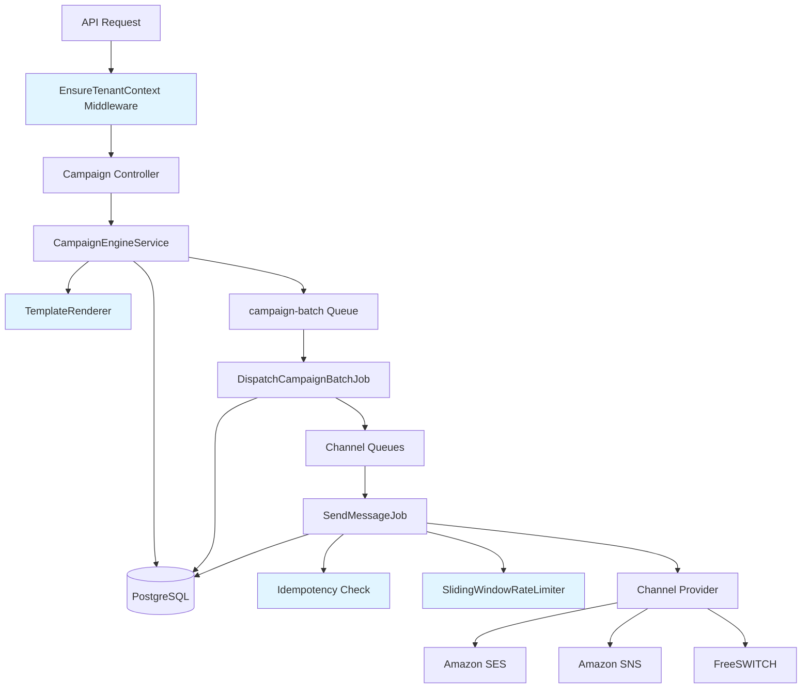
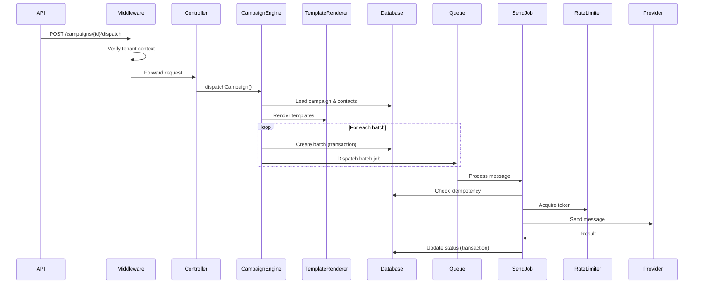
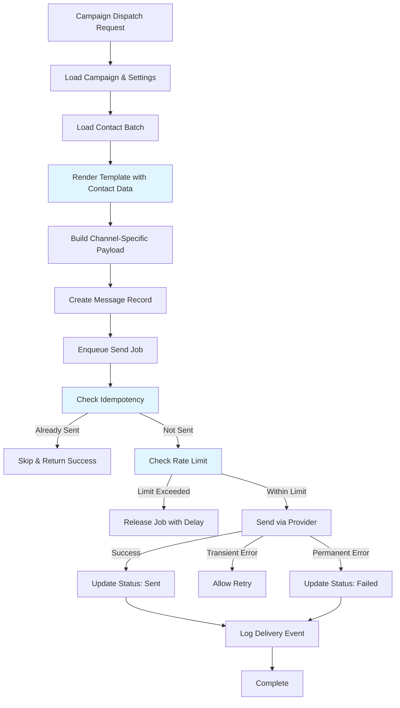
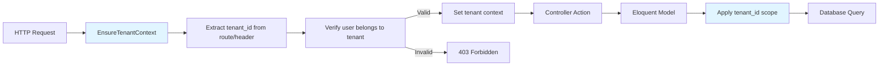
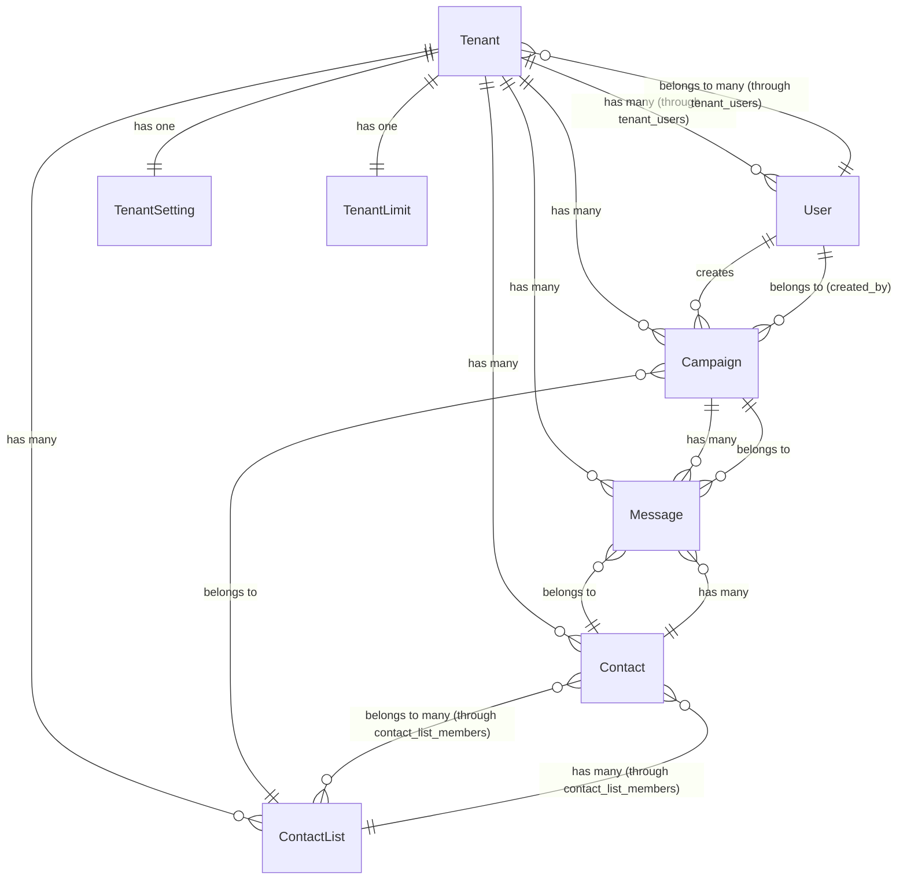
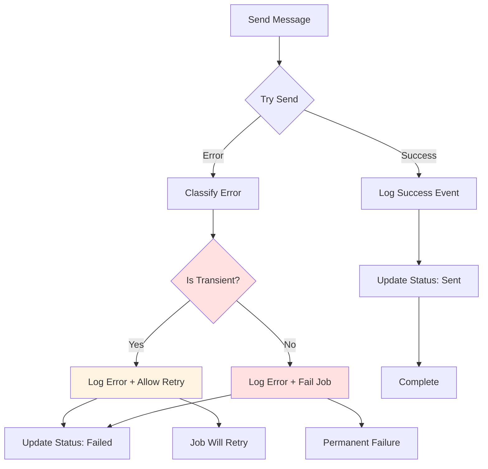
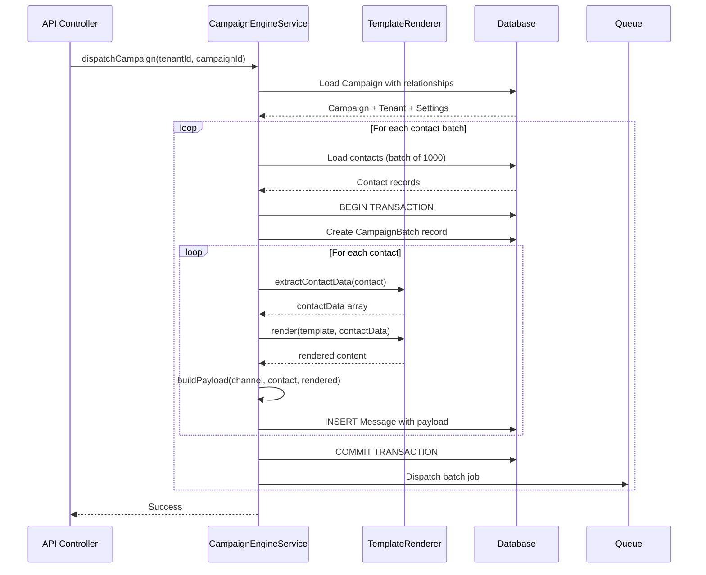
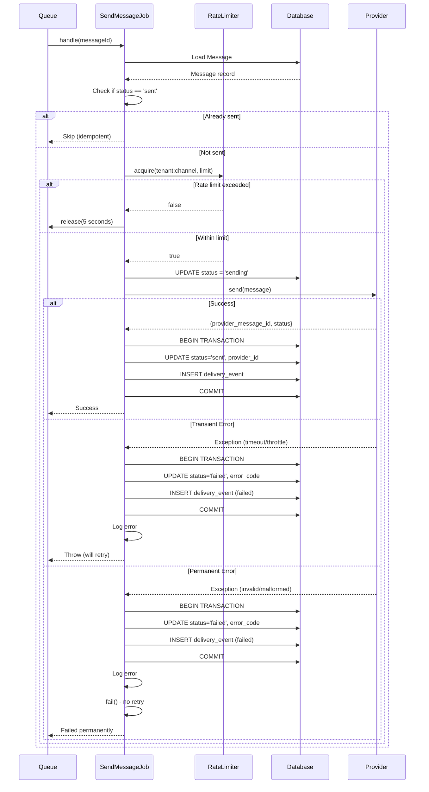
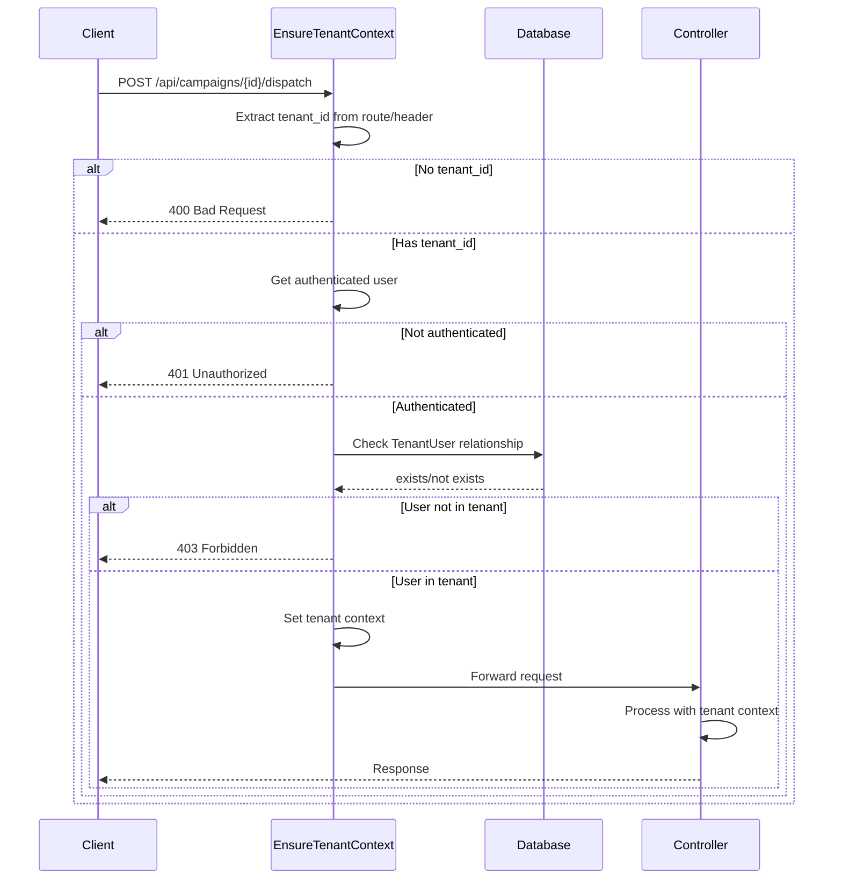
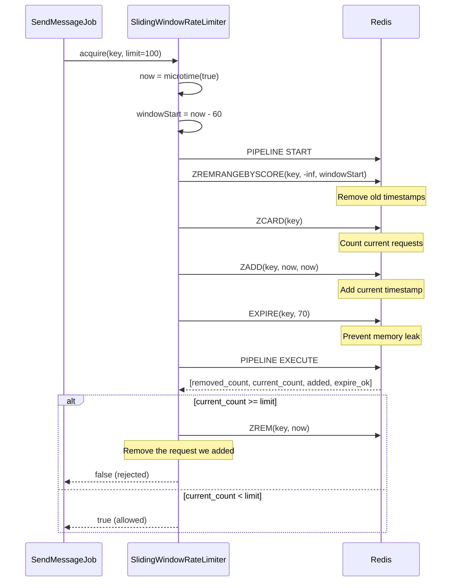

# Design Document: ContactSass Critical Improvements

## Overview

This design document specifies the technical implementation for eight critical improvements to the ContactSass multi-tenant messaging platform. These improvements address functionality gaps in message payload population, tenant isolation, rate limiting, error handling, data modeling, transaction safety, template rendering, and idempotency guarantees.

The improvements enhance the existing queue-based architecture while maintaining backward compatibility with the current campaign orchestration flow. The design leverages Laravel's Eloquent ORM, middleware system, and queue infrastructure to provide robust, scalable solutions.

### Design Goals

1. Complete message payload population with contact and campaign data
2. Enforce strict tenant isolation at the middleware layer
3. Implement accurate sliding window rate limiting using Redis
4. Provide graceful error handling with proper logging and retry logic
5. Introduce Eloquent models for all entities with proper relationships
6. Ensure atomic database operations with transaction boundaries
7. Enable message personalization through Blade template rendering
8. Prevent duplicate message sends through idempotency checks

### Scope

This design covers modifications to existing components and introduction of new components:

**Enhanced Components:**
- `CampaignEngineService` - Add payload population and template rendering
- `DispatchCampaignBatchJob` - Add transaction boundaries and Eloquent usage
- `AbstractSendMessageJob` - Add error handling, idempotency, and Eloquent usage
- Provider classes - Add structured error handling

**New Components:**
- `EnsureTenantContext` middleware
- Eloquent models: `Tenant`, `User`, `Campaign`, `Message`, `Contact`, `ContactList`
- `TemplateRenderer` service
- `SlidingWindowRateLimiter` service


## Architecture

### High-Level Architecture

The improvements maintain the existing queue-based architecture while adding new layers for tenant isolation, payload enrichment, and idempotency:



### Component Interaction Flow




### Data Flow: Message Creation and Delivery



### Tenant Isolation Architecture




## Components and Interfaces

### 1. Tenant Context Middleware

**File:** `app/Http/Middleware/EnsureTenantContext.php`

```php
<?php

declare(strict_types=1);

namespace App\Http\Middleware;

use Closure;
use Illuminate\Http\Request;
use Symfony\Component\HttpFoundation\Response;

final class EnsureTenantContext
{
    public function handle(Request $request, Closure $next): Response
    {
        $tenantId = $request->route('tenant_id') ?? $request->header('X-Tenant-ID');
        
        if (!$tenantId) {
            return response()->json([
                'error' => 'Tenant ID is required'
            ], 400);
        }
        
        $user = $request->user();
        
        if (!$user) {
            return response()->json([
                'error' => 'Unauthenticated'
            ], 401);
        }
        
        // Verify user belongs to tenant
        $belongsToTenant = \App\Models\TenantUser::where('tenant_id', $tenantId)
            ->where('user_id', $user->id)
            ->exists();
        
        if (!$belongsToTenant) {
            return response()->json([
                'error' => 'Access denied to this tenant'
            ], 403);
        }
        
        // Set tenant context for request
        $request->attributes->set('tenant_id', $tenantId);
        app()->instance('current_tenant_id', $tenantId);
        
        return $next($request);
    }
}
```

**Registration:** Add to `app/Http/Kernel.php` route middleware array:
```php
'tenant' => \App\Http\Middleware\EnsureTenantContext::class,
```

**Usage:** Apply to API routes in `routes/api.php`:
```php
Route::middleware(['auth:sanctum', 'tenant'])->group(function () {
    Route::post('/campaigns/{campaign_id}/dispatch', [CampaignController::class, 'dispatch']);
    // ... other tenant-scoped routes
});
```


### 2. Sliding Window Rate Limiter

**File:** `app/Support/SlidingWindowRateLimiter.php`

```php
<?php

declare(strict_types=1);

namespace App\Support;

use Illuminate\Support\Facades\Redis;

final class SlidingWindowRateLimiter
{
    private const WINDOW_SECONDS = 60;
    
    /**
     * Attempt to acquire a rate limit token using sliding window algorithm
     * 
     * @param string $key Unique identifier (e.g., "tenant:uuid:email")
     * @param int $limitPerMinute Maximum requests allowed per minute
     * @return bool True if request is allowed, false if rate limit exceeded
     */
    public function acquire(string $key, int $limitPerMinute): bool
    {
        $now = microtime(true);
        $windowStart = $now - self::WINDOW_SECONDS;
        $redisKey = "ratelimit:sliding:{$key}";
        
        // Use Redis pipeline for atomic operations
        $results = Redis::pipeline(function ($pipe) use ($redisKey, $windowStart, $now, $limitPerMinute) {
            // Remove timestamps outside the sliding window
            $pipe->zremrangebyscore($redisKey, '-inf', (string) $windowStart);
            
            // Count requests in current window
            $pipe->zcard($redisKey);
            
            // Add current request timestamp
            $pipe->zadd($redisKey, $now, (string) $now);
            
            // Set expiration to prevent memory leaks
            $pipe->expire($redisKey, self::WINDOW_SECONDS + 10);
        });
        
        $currentCount = (int) $results[1];
        
        // Check if adding this request would exceed limit
        if ($currentCount >= $limitPerMinute) {
            // Remove the request we just added since we're rejecting it
            Redis::zrem($redisKey, (string) $now);
            return false;
        }
        
        return true;
    }
    
    /**
     * Get current request count in the sliding window
     */
    public function getCurrentCount(string $key): int
    {
        $now = microtime(true);
        $windowStart = $now - self::WINDOW_SECONDS;
        $redisKey = "ratelimit:sliding:{$key}";
        
        Redis::zremrangebyscore($redisKey, '-inf', (string) $windowStart);
        return (int) Redis::zcard($redisKey);
    }
}
```

**Algorithm Explanation:**

The sliding window algorithm uses Redis sorted sets where:
- **Score:** Timestamp (microseconds) when request was made
- **Member:** Unique identifier for each request (timestamp as string)

Steps:
1. Remove all entries older than 60 seconds (outside window)
2. Count remaining entries in the sorted set
3. If count < limit, add current timestamp and allow request
4. If count >= limit, reject request and remove the added timestamp

This prevents the "burst at boundary" problem of fixed windows by continuously sliding the 60-second window.


### 3. Template Renderer

**File:** `app/Support/TemplateRenderer.php`

```php
<?php

declare(strict_types=1);

namespace App\Support;

use Illuminate\Support\Facades\Blade;

final class TemplateRenderer
{
    /**
     * Render a template with contact data substitution
     * 
     * @param string $template Template string with {{variable}} placeholders
     * @param array<string, mixed> $contactData Contact data for substitution
     * @param bool $escapeHtml Whether to escape HTML in variables (for email body)
     * @return string Rendered template
     */
    public function render(string $template, array $contactData, bool $escapeHtml = true): string
    {
        // Prepare data with safe defaults
        $data = $this->prepareData($contactData, $escapeHtml);
        
        // Use Blade's string rendering
        return Blade::render($template, $data);
    }
    
    /**
     * Prepare contact data for template rendering
     * 
     * @param array<string, mixed> $contactData Raw contact data
     * @param bool $escapeHtml Whether to escape HTML
     * @return array<string, string> Prepared data with string values
     */
    private function prepareData(array $contactData, bool $escapeHtml): array
    {
        $prepared = [];
        
        foreach ($contactData as $key => $value) {
            // Convert to string, handle nulls
            $stringValue = $value !== null ? (string) $value : '';
            
            // Escape HTML if needed
            $prepared[$key] = $escapeHtml ? htmlspecialchars($stringValue, ENT_QUOTES, 'UTF-8') : $stringValue;
        }
        
        return $prepared;
    }
    
    /**
     * Extract contact data from database record
     * 
     * @param object $contact Contact database record
     * @return array<string, mixed> Flattened contact data
     */
    public function extractContactData(object $contact): array
    {
        $data = [
            'first_name' => $contact->first_name ?? '',
            'last_name' => $contact->last_name ?? '',
            'email' => $contact->email ?? '',
            'phone' => $contact->phone_e164 ?? '',
        ];
        
        // Merge custom attributes from JSONB column
        if (isset($contact->attributes)) {
            $attributes = is_string($contact->attributes) 
                ? json_decode($contact->attributes, true) 
                : (array) $contact->attributes;
            
            $data = array_merge($data, $attributes);
        }
        
        return $data;
    }
}
```

**Template Syntax:**

Templates use Blade's double curly brace syntax:
```
Hello {{first_name}} {{last_name}},

Your email is {{email}}.
Custom field: {{company_name}}
```

Missing variables are replaced with empty strings. HTML is escaped by default for email bodies to prevent XSS.


### 4. Eloquent Models

#### Model Relationships Diagram



#### Base Model Trait

**File:** `app/Models/Concerns/HasTenantScope.php`

```php
<?php

declare(strict_types=1);

namespace App\Models\Concerns;

use Illuminate\Database\Eloquent\Builder;

trait HasTenantScope
{
    /**
     * Boot the tenant scope trait
     */
    protected static function bootHasTenantScope(): void
    {
        static::addGlobalScope('tenant', function (Builder $builder) {
            if ($tenantId = app('current_tenant_id', null)) {
                $builder->where('tenant_id', $tenantId);
            }
        });
    }
    
    /**
     * Scope query to specific tenant
     */
    public function scopeForTenant(Builder $query, string $tenantId): Builder
    {
        return $query->where('tenant_id', $tenantId);
    }
}
```


#### Tenant Model

**File:** `app/Models/Tenant.php`

```php
<?php

declare(strict_types=1);

namespace App\Models;

use Illuminate\Database\Eloquent\Concerns\HasUuids;
use Illuminate\Database\Eloquent\Model;
use Illuminate\Database\Eloquent\Relations\BelongsToMany;
use Illuminate\Database\Eloquent\Relations\HasMany;
use Illuminate\Database\Eloquent\Relations\HasOne;

final class Tenant extends Model
{
    use HasUuids;
    
    protected $fillable = [
        'name',
        'slug',
        'timezone',
        'is_active',
    ];
    
    protected $casts = [
        'is_active' => 'boolean',
        'created_at' => 'datetime',
        'updated_at' => 'datetime',
    ];
    
    public function users(): BelongsToMany
    {
        return $this->belongsToMany(User::class, 'tenant_users')
            ->withPivot('role')
            ->withTimestamps();
    }
    
    public function campaigns(): HasMany
    {
        return $this->hasMany(Campaign::class);
    }
    
    public function contacts(): HasMany
    {
        return $this->hasMany(Contact::class);
    }
    
    public function contactLists(): HasMany
    {
        return $this->hasMany(ContactList::class);
    }
    
    public function messages(): HasMany
    {
        return $this->hasMany(Message::class);
    }
    
    public function settings(): HasOne
    {
        return $this->hasOne(TenantSetting::class);
    }
    
    public function limits(): HasOne
    {
        return $this->hasOne(TenantLimit::class);
    }
}
```

#### User Model

**File:** `app/Models/User.php`

```php
<?php

declare(strict_types=1);

namespace App\Models;

use Illuminate\Database\Eloquent\Concerns\HasUuids;
use Illuminate\Database\Eloquent\Relations\BelongsToMany;
use Illuminate\Database\Eloquent\Relations\HasMany;
use Illuminate\Foundation\Auth\User as Authenticatable;
use Laravel\Sanctum\HasApiTokens;

final class User extends Authenticatable
{
    use HasApiTokens;
    use HasUuids;
    
    protected $fillable = [
        'name',
        'email',
        'password_hash',
    ];
    
    protected $hidden = [
        'password_hash',
    ];
    
    protected $casts = [
        'created_at' => 'datetime',
        'updated_at' => 'datetime',
    ];
    
    public function tenants(): BelongsToMany
    {
        return $this->belongsToMany(Tenant::class, 'tenant_users')
            ->withPivot('role')
            ->withTimestamps();
    }
    
    public function campaigns(): HasMany
    {
        return $this->hasMany(Campaign::class, 'created_by');
    }
}
```


#### Campaign Model

**File:** `app/Models/Campaign.php`

```php
<?php

declare(strict_types=1);

namespace App\Models;

use App\Models\Concerns\HasTenantScope;
use Illuminate\Database\Eloquent\Concerns\HasUuids;
use Illuminate\Database\Eloquent\Model;
use Illuminate\Database\Eloquent\Relations\BelongsTo;
use Illuminate\Database\Eloquent\Relations\HasMany;

final class Campaign extends Model
{
    use HasUuids;
    use HasTenantScope;
    
    protected $fillable = [
        'tenant_id',
        'created_by',
        'name',
        'channel',
        'status',
        'contact_list_id',
        'subject',
        'template_body',
        'sms_body',
        'voice_audio_s3_key',
        'scheduled_at',
        'metadata',
    ];
    
    protected $casts = [
        'metadata' => 'array',
        'scheduled_at' => 'datetime',
        'started_at' => 'datetime',
        'completed_at' => 'datetime',
        'created_at' => 'datetime',
        'updated_at' => 'datetime',
    ];
    
    public function tenant(): BelongsTo
    {
        return $this->belongsTo(Tenant::class);
    }
    
    public function creator(): BelongsTo
    {
        return $this->belongsTo(User::class, 'created_by');
    }
    
    public function contactList(): BelongsTo
    {
        return $this->belongsTo(ContactList::class);
    }
    
    public function messages(): HasMany
    {
        return $this->hasMany(Message::class);
    }
    
    public function batches(): HasMany
    {
        return $this->hasMany(CampaignBatch::class);
    }
}
```

#### Contact Model

**File:** `app/Models/Contact.php`

```php
<?php

declare(strict_types=1);

namespace App\Models;

use App\Models\Concerns\HasTenantScope;
use Illuminate\Database\Eloquent\Concerns\HasUuids;
use Illuminate\Database\Eloquent\Model;
use Illuminate\Database\Eloquent\Relations\BelongsTo;
use Illuminate\Database\Eloquent\Relations\BelongsToMany;
use Illuminate\Database\Eloquent\Relations\HasMany;

final class Contact extends Model
{
    use HasUuids;
    use HasTenantScope;
    
    protected $fillable = [
        'tenant_id',
        'external_ref',
        'first_name',
        'last_name',
        'email',
        'phone_e164',
        'attributes',
    ];
    
    protected $casts = [
        'attributes' => 'array',
        'created_at' => 'datetime',
        'updated_at' => 'datetime',
    ];
    
    public function tenant(): BelongsTo
    {
        return $this->belongsTo(Tenant::class);
    }
    
    public function lists(): BelongsToMany
    {
        return $this->belongsToMany(ContactList::class, 'contact_list_members', 'contact_id', 'list_id')
            ->withTimestamps();
    }
    
    public function messages(): HasMany
    {
        return $this->hasMany(Message::class);
    }
}
```


#### ContactList Model

**File:** `app/Models/ContactList.php`

```php
<?php

declare(strict_types=1);

namespace App\Models;

use App\Models\Concerns\HasTenantScope;
use Illuminate\Database\Eloquent\Concerns\HasUuids;
use Illuminate\Database\Eloquent\Model;
use Illuminate\Database\Eloquent\Relations\BelongsTo;
use Illuminate\Database\Eloquent\Relations\BelongsToMany;
use Illuminate\Database\Eloquent\Relations\HasMany;

final class ContactList extends Model
{
    use HasUuids;
    use HasTenantScope;
    
    protected $fillable = [
        'tenant_id',
        'name',
        'segmentation_rule',
    ];
    
    protected $casts = [
        'segmentation_rule' => 'array',
        'created_at' => 'datetime',
        'updated_at' => 'datetime',
    ];
    
    public function tenant(): BelongsTo
    {
        return $this->belongsTo(Tenant::class);
    }
    
    public function contacts(): BelongsToMany
    {
        return $this->belongsToMany(Contact::class, 'contact_list_members', 'list_id', 'contact_id')
            ->withTimestamps();
    }
    
    public function campaigns(): HasMany
    {
        return $this->hasMany(Campaign::class);
    }
}
```

#### Message Model

**File:** `app/Models/Message.php`

```php
<?php

declare(strict_types=1);

namespace App\Models;

use App\Models\Concerns\HasTenantScope;
use Illuminate\Database\Eloquent\Concerns\HasUuids;
use Illuminate\Database\Eloquent\Model;
use Illuminate\Database\Eloquent\Relations\BelongsTo;
use Illuminate\Database\Eloquent\Relations\HasMany;

final class Message extends Model
{
    use HasUuids;
    use HasTenantScope;
    
    protected $fillable = [
        'tenant_id',
        'campaign_id',
        'batch_id',
        'contact_id',
        'channel',
        'provider_message_id',
        'message_uuid',
        'status',
        'error_code',
        'error_message',
        'payload',
        'queued_at',
        'sent_at',
    ];
    
    protected $casts = [
        'payload' => 'array',
        'queued_at' => 'datetime',
        'sent_at' => 'datetime',
        'created_at' => 'datetime',
        'updated_at' => 'datetime',
    ];
    
    public function tenant(): BelongsTo
    {
        return $this->belongsTo(Tenant::class);
    }
    
    public function campaign(): BelongsTo
    {
        return $this->belongsTo(Campaign::class);
    }
    
    public function contact(): BelongsTo
    {
        return $this->belongsTo(Contact::class);
    }
    
    public function batch(): BelongsTo
    {
        return $this->belongsTo(CampaignBatch::class, 'batch_id');
    }
    
    public function deliveryEvents(): HasMany
    {
        return $this->hasMany(DeliveryEvent::class);
    }
}
```


#### Supporting Models

**File:** `app/Models/TenantUser.php`

```php
<?php

declare(strict_types=1);

namespace App\Models;

use Illuminate\Database\Eloquent\Concerns\HasUuids;
use Illuminate\Database\Eloquent\Model;

final class TenantUser extends Model
{
    use HasUuids;
    
    protected $fillable = ['tenant_id', 'user_id', 'role'];
}
```

**File:** `app/Models/TenantSetting.php`

```php
<?php

declare(strict_types=1);

namespace App\Models;

use Illuminate\Database\Eloquent\Model;
use Illuminate\Database\Eloquent\Relations\BelongsTo;

final class TenantSetting extends Model
{
    protected $primaryKey = 'tenant_id';
    public $incrementing = false;
    protected $keyType = 'string';
    
    protected $fillable = [
        'tenant_id',
        'default_email_from',
        'default_sms_sender',
        'default_voice_caller_id',
    ];
    
    public function tenant(): BelongsTo
    {
        return $this->belongsTo(Tenant::class);
    }
}
```

**File:** `app/Models/TenantLimit.php`

```php
<?php

declare(strict_types=1);

namespace App\Models;

use Illuminate\Database\Eloquent\Model;
use Illuminate\Database\Eloquent\Relations\BelongsTo;

final class TenantLimit extends Model
{
    protected $primaryKey = 'tenant_id';
    public $incrementing = false;
    protected $keyType = 'string';
    
    protected $fillable = [
        'tenant_id',
        'emails_per_minute',
        'sms_per_minute',
        'calls_per_minute',
        'monthly_email_limit',
        'monthly_sms_limit',
        'monthly_voice_minutes_limit',
    ];
    
    protected $casts = [
        'emails_per_minute' => 'integer',
        'sms_per_minute' => 'integer',
        'calls_per_minute' => 'integer',
        'monthly_email_limit' => 'integer',
        'monthly_sms_limit' => 'integer',
        'monthly_voice_minutes_limit' => 'integer',
    ];
    
    public function tenant(): BelongsTo
    {
        return $this->belongsTo(Tenant::class);
    }
}
```

**File:** `app/Models/CampaignBatch.php`

```php
<?php

declare(strict_types=1);

namespace App\Models;

use Illuminate\Database\Eloquent\Concerns\HasUuids;
use Illuminate\Database\Eloquent\Model;
use Illuminate\Database\Eloquent\Relations\BelongsTo;
use Illuminate\Database\Eloquent\Relations\HasMany;

final class CampaignBatch extends Model
{
    use HasUuids;
    
    protected $fillable = [
        'campaign_id',
        'batch_number',
        'total_recipients',
        'status',
        'started_at',
        'completed_at',
    ];
    
    protected $casts = [
        'started_at' => 'datetime',
        'completed_at' => 'datetime',
        'created_at' => 'datetime',
    ];
    
    public function campaign(): BelongsTo
    {
        return $this->belongsTo(Campaign::class);
    }
    
    public function messages(): HasMany
    {
        return $this->hasMany(Message::class, 'batch_id');
    }
}
```


## Data Models

### Message Payload Structure

The message payload is a JSON structure stored in the `messages.payload` JSONB column. The structure varies by channel:

#### Email Payload

```json
{
  "to": "contact@example.com",
  "from": "campaigns@tenant.com",
  "subject": "Hello John Doe",
  "body": "<html><body>Hello John,<br>Your personalized content...</body></html>",
  "reply_to": "support@tenant.com"
}
```

#### SMS Payload

```json
{
  "to": "+12125551234",
  "from": "TENANT",
  "body": "Hello John, your personalized SMS message..."
}
```

#### Voice Payload

```json
{
  "to": "+12125551234",
  "from": "+18005551234",
  "audio_url": "https://s3.amazonaws.com/bucket/audio/campaign-uuid.mp3",
  "caller_id": "+18005551234"
}
```

### Payload Population Algorithm

The `CampaignEngineService` populates payloads during message creation:

```
FOR EACH contact IN batch:
  1. Load contact data (first_name, last_name, email, phone, attributes)
  2. Load campaign template (subject, body, audio_url)
  3. Load tenant settings (default_from, default_sender, default_caller_id)
  
  4. Render templates with contact data:
     - subject = TemplateRenderer.render(campaign.subject, contactData)
     - body = TemplateRenderer.render(campaign.template_body, contactData)
  
  5. Build channel-specific payload:
     MATCH channel:
       CASE email:
         payload = {
           to: contact.email,
           from: tenantSettings.default_email_from,
           subject: rendered_subject,
           body: rendered_body
         }
       CASE sms:
         payload = {
           to: contact.phone_e164,
           from: tenantSettings.default_sms_sender,
           body: rendered_body
         }
       CASE voice:
         payload = {
           to: contact.phone_e164,
           from: tenantSettings.default_voice_caller_id,
           audio_url: campaign.voice_audio_s3_key,
           caller_id: tenantSettings.default_voice_caller_id
         }
  
  6. Create message record with populated payload
```


### Enhanced CampaignEngineService

**File:** `app/Campaign/Services/CampaignEngineService.php` (Enhanced)

```php
<?php

declare(strict_types=1);

namespace App\Campaign\Services;

use App\Campaign\DTO\CampaignBatchPayload;
use App\Campaign\Jobs\DispatchCampaignBatchJob;
use App\Models\Campaign;
use App\Models\Contact;
use App\Models\TenantSetting;
use App\Support\TemplateRenderer;
use Illuminate\Support\Facades\DB;
use Illuminate\Support\Str;

final class CampaignEngineService
{
    private const DEFAULT_BATCH_SIZE = 1000;
    
    public function __construct(
        private readonly TemplateRenderer $templateRenderer
    ) {}
    
    public function dispatchCampaign(string $tenantId, string $campaignId, int $batchSize = self::DEFAULT_BATCH_SIZE): void
    {
        $campaign = Campaign::with(['contactList', 'tenant.settings'])
            ->forTenant($tenantId)
            ->findOrFail($campaignId);
        
        // Update campaign status
        $campaign->update([
            'status' => 'running',
            'started_at' => now(),
        ]);
        
        // Get tenant settings for defaults
        $tenantSettings = $campaign->tenant->settings;
        
        // Process contacts in batches
        $campaign->contactList->contacts()
            ->orderBy('id')
            ->chunk($batchSize, function ($contacts, int $page) use ($campaign, $tenantSettings, $tenantId, $campaignId) {
                $this->processBatch($campaign, $contacts, $page, $tenantSettings, $tenantId, $campaignId);
            });
    }
    
    private function processBatch(
        Campaign $campaign,
        $contacts,
        int $batchNumber,
        ?TenantSetting $tenantSettings,
        string $tenantId,
        string $campaignId
    ): void {
        $batchId = (string) Str::uuid();
        $contactIds = $contacts->pluck('id')->map(fn($id) => (string) $id)->all();
        
        // Create batch record
        DB::table('campaign_batches')->insert([
            'id' => $batchId,
            'campaign_id' => $campaignId,
            'batch_number' => $batchNumber,
            'total_recipients' => count($contactIds),
            'status' => 'queued',
            'created_at' => now(),
        ]);
        
        // Prepare payload for job
        $payload = new CampaignBatchPayload(
            tenantId: $tenantId,
            campaignId: $campaignId,
            batchId: $batchId,
            batchNumber: $batchNumber,
            channel: $campaign->channel,
            contactIds: $contactIds,
        );
        
        DispatchCampaignBatchJob::dispatch($payload->toArray())->onQueue('campaign-batch');
    }
}
```


### Enhanced DispatchCampaignBatchJob

**File:** `app/Campaign/Jobs/DispatchCampaignBatchJob.php` (Enhanced)

```php
<?php

declare(strict_types=1);

namespace App\Campaign\Jobs;

use App\Campaign\DTO\CampaignBatchPayload;
use App\Messaging\Enums\MessageChannel;
use App\Messaging\Jobs\SendEmailMessageJob;
use App\Messaging\Jobs\SendSmsMessageJob;
use App\Messaging\Jobs\SendVoiceMessageJob;
use App\Models\Campaign;
use App\Models\CampaignBatch;
use App\Models\Contact;
use App\Models\Message;
use App\Support\TemplateRenderer;
use Illuminate\Bus\Queueable;
use Illuminate\Contracts\Queue\ShouldQueue;
use Illuminate\Foundation\Bus\Dispatchable;
use Illuminate\Queue\InteractsWithQueue;
use Illuminate\Queue\SerializesModels;
use Illuminate\Support\Facades\DB;
use Illuminate\Support\Str;

final class DispatchCampaignBatchJob implements ShouldQueue
{
    use Dispatchable;
    use InteractsWithQueue;
    use Queueable;
    use SerializesModels;
    
    public int $tries = 5;
    
    public function __construct(private readonly array $payload)
    {
    }
    
    public function handle(TemplateRenderer $templateRenderer): void
    {
        $batch = CampaignBatchPayload::fromArray($this->payload);
        
        // Update batch status
        CampaignBatch::where('id', $batch->batchId)->update([
            'status' => 'running',
            'started_at' => now(),
        ]);
        
        // Load campaign with relationships
        $campaign = Campaign::with(['tenant.settings'])->findOrFail($batch->campaignId);
        $tenantSettings = $campaign->tenant->settings;
        
        // Load all contacts in batch
        $contacts = Contact::whereIn('id', $batch->contactIds)->get()->keyBy('id');
        
        // Process each contact in a transaction
        DB::transaction(function () use ($batch, $campaign, $contacts, $tenantSettings, $templateRenderer) {
            foreach ($batch->contactIds as $contactId) {
                $contact = $contacts->get($contactId);
                
                if (!$contact) {
                    continue;
                }
                
                // Extract contact data for template rendering
                $contactData = $templateRenderer->extractContactData($contact);
                
                // Build channel-specific payload
                $payload = $this->buildPayload(
                    $campaign,
                    $contact,
                    $contactData,
                    $tenantSettings,
                    $templateRenderer
                );
                
                // Create message with populated payload
                $messageId = (string) Str::uuid();
                $messageUuid = (string) Str::uuid();
                
                Message::create([
                    'id' => $messageId,
                    'tenant_id' => $batch->tenantId,
                    'campaign_id' => $batch->campaignId,
                    'batch_id' => $batch->batchId,
                    'contact_id' => $contactId,
                    'channel' => $batch->channel->value,
                    'message_uuid' => $messageUuid,
                    'status' => 'queued',
                    'payload' => $payload,
                    'queued_at' => now(),
                ]);
                
                // Dispatch to channel-specific queue
                $this->dispatchToChannel($batch->channel, $messageId);
            }
        });
        
        // Update batch status
        CampaignBatch::where('id', $batch->batchId)->update([
            'status' => 'completed',
            'completed_at' => now(),
        ]);
    }
    
    private function buildPayload(
        Campaign $campaign,
        Contact $contact,
        array $contactData,
        ?object $tenantSettings,
        TemplateRenderer $templateRenderer
    ): array {
        return match ($campaign->channel) {
            'email' => [
                'to' => $contact->email,
                'from' => $tenantSettings?->default_email_from ?? config('mail.from.address'),
                'subject' => $templateRenderer->render($campaign->subject ?? '', $contactData, false),
                'body' => $templateRenderer->render($campaign->template_body ?? '', $contactData, true),
            ],
            'sms' => [
                'to' => $contact->phone_e164,
                'from' => $tenantSettings?->default_sms_sender ?? config('messaging.sms.default_sender'),
                'body' => $templateRenderer->render($campaign->sms_body ?? '', $contactData, false),
            ],
            'voice' => [
                'to' => $contact->phone_e164,
                'from' => $tenantSettings?->default_voice_caller_id ?? config('messaging.voice.default_caller_id'),
                'audio_url' => $campaign->voice_audio_s3_key,
                'caller_id' => $tenantSettings?->default_voice_caller_id ?? config('messaging.voice.default_caller_id'),
            ],
        };
    }
    
    private function dispatchToChannel(MessageChannel $channel, string $messageId): void
    {
        match ($channel) {
            MessageChannel::Email => SendEmailMessageJob::dispatch($messageId)->onQueue('email-send'),
            MessageChannel::Sms => SendSmsMessageJob::dispatch($messageId)->onQueue('sms-send'),
            MessageChannel::Voice => SendVoiceMessageJob::dispatch($messageId)->onQueue('voice-send'),
        };
    }
}
```


### Enhanced AbstractSendMessageJob

**File:** `app/Messaging/Jobs/AbstractSendMessageJob.php` (Enhanced)

```php
<?php

declare(strict_types=1);

namespace App\Messaging\Jobs;

use App\Messaging\Contracts\ChannelProvider;
use App\Messaging\DTO\OutboundMessage;
use App\Models\Message;
use App\Models\TenantLimit;
use App\Support\SlidingWindowRateLimiter;
use Illuminate\Bus\Queueable;
use Illuminate\Contracts\Queue\ShouldQueue;
use Illuminate\Database\QueryException;
use Illuminate\Foundation\Bus\Dispatchable;
use Illuminate\Queue\InteractsWithQueue;
use Illuminate\Queue\SerializesModels;
use Illuminate\Support\Facades\DB;
use Illuminate\Support\Facades\Log;

abstract class AbstractSendMessageJob implements ShouldQueue
{
    use Dispatchable;
    use InteractsWithQueue;
    use Queueable;
    use SerializesModels;
    
    public int $tries = 8;
    public int $backoff = 60;
    
    public function __construct(protected readonly string $messageId)
    {
    }
    
    abstract protected function getProvider(): ChannelProvider;
    abstract protected function getRateLimitMetric(): string;
    
    public function handle(SlidingWindowRateLimiter $rateLimiter): void
    {
        // Load message with relationships
        $message = Message::with(['tenant.limits'])->findOrFail($this->messageId);
        
        // Idempotency check: Skip if already sent
        if ($message->status === 'sent') {
            Log::info('Message already sent, skipping', [
                'message_id' => $this->messageId,
                'message_uuid' => $message->message_uuid,
            ]);
            return;
        }
        
        // Get rate limit for tenant and channel
        $limit = $this->getRateLimit($message->tenant->limits);
        $rateLimitKey = "{$message->tenant_id}:{$this->getRateLimitMetric()}";
        
        // Check rate limit
        if (!$rateLimiter->acquire($rateLimitKey, $limit)) {
            Log::debug('Rate limit exceeded, releasing job', [
                'message_id' => $this->messageId,
                'tenant_id' => $message->tenant_id,
                'metric' => $this->getRateLimitMetric(),
            ]);
            $this->release(5);
            return;
        }
        
        // Update status to sending
        $message->update(['status' => 'sending']);
        
        // Prepare outbound message
        $outbound = new OutboundMessage(
            messageId: $message->id,
            tenantId: $message->tenant_id,
            campaignId: $message->campaign_id,
            contactId: $message->contact_id,
            channel: $message->channel,
            payload: $message->payload,
        );
        
        try {
            // Send via provider
            $result = $this->getProvider()->send($outbound);
            
            // Update message as sent
            DB::transaction(function () use ($message, $result) {
                $message->update([
                    'provider_message_id' => $result['provider_message_id'] ?? null,
                    'status' => 'sent',
                    'sent_at' => now(),
                ]);
                
                // Log delivery event
                DB::table('delivery_events')->insert([
                    'tenant_id' => $message->tenant_id,
                    'message_id' => $message->id,
                    'channel' => $message->channel,
                    'event_type' => 'sent',
                    'provider_event_id' => $result['provider_message_id'] ?? null,
                    'event_payload' => json_encode($result),
                    'occurred_at' => now(),
                    'created_at' => now(),
                ]);
            });
            
            Log::info('Message sent successfully', [
                'message_id' => $this->messageId,
                'provider_message_id' => $result['provider_message_id'] ?? null,
            ]);
            
        } catch (\Throwable $e) {
            $this->handleProviderError($message, $e);
        }
    }
    
    private function getRateLimit(?TenantLimit $limits): int
    {
        if (!$limits) {
            return $this->getDefaultRateLimit();
        }
        
        return match ($this->getRateLimitMetric()) {
            'emails_per_minute' => $limits->emails_per_minute,
            'sms_per_minute' => $limits->sms_per_minute,
            'calls_per_minute' => $limits->calls_per_minute,
            default => $this->getDefaultRateLimit(),
        };
    }
    
    private function getDefaultRateLimit(): int
    {
        return match ($this->getRateLimitMetric()) {
            'emails_per_minute' => 1000,
            'sms_per_minute' => 600,
            'calls_per_minute' => 120,
            default => 60,
        };
    }
    
    private function handleProviderError(Message $message, \Throwable $e): void
    {
        $errorCode = $this->extractErrorCode($e);
        $errorMessage = $e->getMessage();
        $isTransient = $this->isTransientError($e);
        
        Log::error('Provider error during message send', [
            'message_id' => $this->messageId,
            'message_uuid' => $message->message_uuid,
            'tenant_id' => $message->tenant_id,
            'campaign_id' => $message->campaign_id,
            'channel' => $message->channel,
            'error_code' => $errorCode,
            'error_message' => $errorMessage,
            'is_transient' => $isTransient,
            'exception' => get_class($e),
        ]);
        
        // Update message status
        DB::transaction(function () use ($message, $errorCode, $errorMessage) {
            $message->update([
                'status' => 'failed',
                'error_code' => $errorCode,
                'error_message' => substr($errorMessage, 0, 500),
            ]);
            
            // Log failure event
            DB::table('delivery_events')->insert([
                'tenant_id' => $message->tenant_id,
                'message_id' => $message->id,
                'channel' => $message->channel,
                'event_type' => 'failed',
                'event_payload' => json_encode([
                    'error_code' => $errorCode,
                    'error_message' => $errorMessage,
                ]),
                'occurred_at' => now(),
                'created_at' => now(),
            ]);
        });
        
        // Fail job permanently if error is not transient
        if (!$isTransient) {
            $this->fail($e);
        } else {
            // Allow retry for transient errors
            throw $e;
        }
    }
    
    private function extractErrorCode(\Throwable $e): ?string
    {
        // Extract error code from AWS SDK exceptions
        if (method_exists($e, 'getAwsErrorCode')) {
            return $e->getAwsErrorCode();
        }
        
        // Extract from exception class name
        $className = class_basename($e);
        return substr($className, 0, 100);
    }
    
    private function isTransientError(\Throwable $e): bool
    {
        $message = strtolower($e->getMessage());
        $transientPatterns = [
            'timeout',
            'connection',
            'network',
            'throttl',
            'rate limit',
            'too many requests',
            'service unavailable',
            '503',
            '429',
        ];
        
        foreach ($transientPatterns as $pattern) {
            if (str_contains($message, $pattern)) {
                return true;
            }
        }
        
        // Check AWS SDK throttling exceptions
        if (method_exists($e, 'getAwsErrorCode')) {
            $code = $e->getAwsErrorCode();
            if (in_array($code, ['Throttling', 'RequestLimitExceeded', 'ServiceUnavailable'])) {
                return true;
            }
        }
        
        return false;
    }
}
```


### Channel-Specific Send Jobs

**File:** `app/Messaging/Jobs/SendEmailMessageJob.php`

```php
<?php

declare(strict_types=1);

namespace App\Messaging\Jobs;

use App\Integrations\AmazonSesProvider;
use App\Messaging\Contracts\ChannelProvider;

final class SendEmailMessageJob extends AbstractSendMessageJob
{
    public function __construct(
        string $messageId,
        private readonly ?AmazonSesProvider $provider = null
    ) {
        parent::__construct($messageId);
    }
    
    protected function getProvider(): ChannelProvider
    {
        return $this->provider ?? app(AmazonSesProvider::class);
    }
    
    protected function getRateLimitMetric(): string
    {
        return 'emails_per_minute';
    }
}
```

**File:** `app/Messaging/Jobs/SendSmsMessageJob.php`

```php
<?php

declare(strict_types=1);

namespace App\Messaging\Jobs;

use App\Integrations\AmazonSnsProvider;
use App\Messaging\Contracts\ChannelProvider;

final class SendSmsMessageJob extends AbstractSendMessageJob
{
    public function __construct(
        string $messageId,
        private readonly ?AmazonSnsProvider $provider = null
    ) {
        parent::__construct($messageId);
    }
    
    protected function getProvider(): ChannelProvider
    {
        return $this->provider ?? app(AmazonSnsProvider::class);
    }
    
    protected function getRateLimitMetric(): string
    {
        return 'sms_per_minute';
    }
}
```

**File:** `app/Messaging/Jobs/SendVoiceMessageJob.php`

```php
<?php

declare(strict_types=1);

namespace App\Messaging\Jobs;

use App\Integrations\FreeSwitchEslProvider;
use App\Messaging\Contracts\ChannelProvider;

final class SendVoiceMessageJob extends AbstractSendMessageJob
{
    public function __construct(
        string $messageId,
        private readonly ?FreeSwitchEslProvider $provider = null
    ) {
        parent::__construct($messageId);
    }
    
    protected function getProvider(): ChannelProvider
    {
        return $this->provider ?? app(FreeSwitchEslProvider::class);
    }
    
    protected function getRateLimitMetric(): string
    {
        return 'calls_per_minute';
    }
}
```


### Enhanced Provider Error Handling

**File:** `app/Integrations/AmazonSesProvider.php` (Enhanced)

```php
<?php

declare(strict_types=1);

namespace App\Integrations;

use App\Messaging\Contracts\ChannelProvider;
use App\Messaging\DTO\OutboundMessage;
use Aws\Exception\AwsException;
use Aws\Ses\SesClient;

final readonly class AmazonSesProvider implements ChannelProvider
{
    public function __construct(private SesClient $client)
    {
    }
    
    public function send(OutboundMessage $message): array
    {
        try {
            $result = $this->client->sendEmail([
                'Destination' => [
                    'ToAddresses' => [$message->payload['to'] ?? ''],
                ],
                'Message' => [
                    'Subject' => [
                        'Data' => $message->payload['subject'] ?? '',
                        'Charset' => 'UTF-8',
                    ],
                    'Body' => [
                        'Html' => [
                            'Data' => $message->payload['body'] ?? '',
                            'Charset' => 'UTF-8',
                        ],
                    ],
                ],
                'Source' => $message->payload['from'] ?? '',
            ]);
            
            return [
                'provider_message_id' => (string) $result->get('MessageId'),
                'status' => 'sent',
            ];
            
        } catch (AwsException $e) {
            throw new \RuntimeException(
                sprintf('SES send failed: %s', $e->getAwsErrorMessage() ?? $e->getMessage()),
                $e->getStatusCode(),
                $e
            );
        }
    }
}
```

**File:** `app/Integrations/AmazonSnsProvider.php` (Enhanced)

```php
<?php

declare(strict_types=1);

namespace App\Integrations;

use App\Messaging\Contracts\ChannelProvider;
use App\Messaging\DTO\OutboundMessage;
use Aws\Exception\AwsException;
use Aws\Sns\SnsClient;

final readonly class AmazonSnsProvider implements ChannelProvider
{
    public function __construct(private SnsClient $client)
    {
    }
    
    public function send(OutboundMessage $message): array
    {
        try {
            $result = $this->client->publish([
                'PhoneNumber' => $message->payload['to'] ?? '',
                'Message' => $message->payload['body'] ?? '',
                'MessageAttributes' => [
                    'AWS.SNS.SMS.SenderID' => [
                        'DataType' => 'String',
                        'StringValue' => $message->payload['from'] ?? '',
                    ],
                ],
            ]);
            
            return [
                'provider_message_id' => (string) $result->get('MessageId'),
                'status' => 'sent',
            ];
            
        } catch (AwsException $e) {
            throw new \RuntimeException(
                sprintf('SNS send failed: %s', $e->getAwsErrorMessage() ?? $e->getMessage()),
                $e->getStatusCode(),
                $e
            );
        }
    }
}
```

**File:** `app/Integrations/FreeSwitchEslProvider.php` (Enhanced)

```php
<?php

declare(strict_types=1);

namespace App\Integrations;

use App\Messaging\Contracts\ChannelProvider;
use App\Messaging\DTO\OutboundMessage;

final readonly class FreeSwitchEslProvider implements ChannelProvider
{
    public function __construct(private FreeSwitchEslClient $client)
    {
    }
    
    public function send(OutboundMessage $message): array
    {
        try {
            $callId = $this->client->originate([
                'destination' => $message->payload['to'] ?? '',
                'caller_id' => $message->payload['caller_id'] ?? '',
                'audio_url' => $message->payload['audio_url'] ?? '',
            ]);
            
            return [
                'provider_message_id' => $callId,
                'status' => 'sent',
            ];
            
        } catch (\Throwable $e) {
            throw new \RuntimeException(
                sprintf('FreeSWITCH originate failed: %s', $e->getMessage()),
                0,
                $e
            );
        }
    }
}
```


## Error Handling

### Error Classification

Errors are classified into two categories for retry logic:

**Transient Errors (Allow Retry):**
- Network timeouts
- Connection failures
- Rate limiting (429, Throttling)
- Service unavailable (503)
- Temporary provider issues

**Permanent Errors (Fail Immediately):**
- Invalid credentials (401, 403)
- Malformed request (400)
- Invalid recipient address
- Missing required fields
- Account suspended

### Error Handling Flow



### Logging Strategy

All provider errors are logged with comprehensive context:

```php
Log::error('Provider error during message send', [
    'message_id' => $messageId,
    'message_uuid' => $messageUuid,
    'tenant_id' => $tenantId,
    'campaign_id' => $campaignId,
    'channel' => $channel,
    'error_code' => $errorCode,
    'error_message' => $errorMessage,
    'is_transient' => $isTransient,
    'exception' => get_class($exception),
    'attempt' => $this->attempts(),
]);
```

This enables:
- Debugging specific message failures
- Identifying provider-specific issues
- Tracking retry patterns
- Monitoring error rates per tenant/campaign


## Testing Strategy

### Dual Testing Approach

The implementation requires both unit tests and property-based tests for comprehensive coverage:

**Unit Tests:**
- Specific examples demonstrating correct behavior
- Edge cases (empty payloads, missing fields, null values)
- Error conditions (invalid credentials, malformed requests)
- Integration points between components
- Middleware behavior (valid/invalid tenant access)

**Property-Based Tests:**
- Universal properties that hold for all inputs
- Comprehensive input coverage through randomization
- Minimum 100 iterations per property test
- Each test references its design document property

### Testing Libraries

**PHP Property-Based Testing:**
- Use **Eris** (https://github.com/giorgiosironi/eris) for property-based testing in PHP
- Eris integrates with PHPUnit for seamless test execution
- Provides generators for random data (strings, integers, arrays, UUIDs)

**Example Property Test Setup:**

```php
use Eris\Generator;
use Eris\TestTrait;

class MessagePayloadTest extends TestCase
{
    use TestTrait;
    
    /** @test */
    public function property_email_payload_contains_required_fields()
    {
        $this->forAll(
            Generator\string(),  // email
            Generator\string(),  // subject
            Generator\string()   // body
        )
        ->then(function ($email, $subject, $body) {
            $payload = $this->buildEmailPayload($email, $subject, $body);
            
            $this->assertArrayHasKey('to', $payload);
            $this->assertArrayHasKey('from', $payload);
            $this->assertArrayHasKey('subject', $payload);
            $this->assertArrayHasKey('body', $payload);
        });
    }
}
```

### Test Configuration

All property tests must:
- Run minimum 100 iterations: `$this->minimumEvaluationRatio(0.5)->limitTo(100)`
- Include tag comment referencing design property
- Use descriptive test method names starting with `property_`

**Tag Format:**
```php
/**
 * Feature: contactsass-critical-improvements, Property 1: Template rendering preserves structure
 * @test
 */
public function property_template_rendering_round_trip()
{
    // Property test implementation
}
```


## Correctness Properties

A property is a characteristic or behavior that should hold true across all valid executions of a system—essentially, a formal statement about what the system should do. Properties serve as the bridge between human-readable specifications and machine-verifiable correctness guarantees.

### Property Reflection

After analyzing all acceptance criteria, I identified the following redundancies and consolidations:

**Redundancy Analysis:**

1. Properties 1.1, 1.2, 1.3 (channel-specific payload fields) can be consolidated into a single property that validates payload structure per channel
2. Properties 1.4 and 1.5 (tenant and contact data in payload) are subsumed by the consolidated payload property
3. Properties 2.1 and 2.2 (tenant access control) are inverse cases of the same property
4. Properties 3.2 and 3.3 (rate limit check and rejection) can be combined into one property about rate limit enforcement
5. Properties 4.2 and 4.3 (update status and store error) are part of the same atomic operation
6. Properties 6.1 and 6.2 (transaction wrapping and rollback) test the same atomicity guarantee
7. Properties 7.2, 7.3, 7.4, 7.5 (template rendering for different channels/fields) can be consolidated into general template rendering properties
8. Properties 8.2 and 8.3 (idempotency for sent/failed) are cases of the same idempotency property

**Consolidated Properties:**

After reflection, the following properties provide unique validation value without redundancy:


### Property 1: Channel-Specific Payload Completeness

For any message created through the Campaign Engine, the payload must contain all required fields for its channel: email messages must have 'to', 'from', 'subject', and 'body'; SMS messages must have 'to', 'from', and 'body'; voice messages must have 'to', 'from', 'audio_url', and 'caller_id'.

**Validates: Requirements 1.1, 1.2, 1.3, 1.4, 1.5**

### Property 2: Payload JSON Round-Trip

For any message payload created by the Campaign Engine, serializing to JSON and then deserializing must produce an equivalent data structure.

**Validates: Requirements 1.6**

### Property 3: Tenant Access Control

For any authenticated user and any tenant, the user can access the tenant's resources if and only if the user belongs to that tenant.

**Validates: Requirements 2.1, 2.2**

### Property 4: Tenant Context Propagation

For any valid API request with tenant authentication, the tenant context must be accessible throughout the request lifecycle.

**Validates: Requirements 2.3**

### Property 5: Sliding Window Request Counting

For any sequence of requests within a time window, the sliding window rate limiter must correctly count only requests within the last 60 seconds.

**Validates: Requirements 3.1, 3.6**

### Property 6: Rate Limit Enforcement

For any tenant and channel, when the number of requests in the sliding window reaches the configured limit, subsequent requests must be rejected until the window slides forward.

**Validates: Requirements 3.2, 3.3**

### Property 7: Rate Limit Isolation

For any two different tenants or two different channels, rate limit counters must be independent such that requests from one do not affect the rate limit of the other.

**Validates: Requirements 3.4**

### Property 8: Sliding Window Boundary Protection

For any sequence of requests distributed across a window boundary, the sliding window algorithm must prevent bursts that would be allowed by fixed windows.

**Validates: Requirements 3.7**

### Property 9: Provider Error Capture

For any provider error during message send, the error must be caught, logged with context (tenant_id, campaign_id, message_uuid, error details), and the message status must be updated to 'failed' with error information stored.

**Validates: Requirements 4.1, 4.2, 4.3, 4.6**

### Property 10: Transient Error Retry

For any provider error classified as transient (timeout, connection failure, rate limit), the job must be allowed to retry.

**Validates: Requirements 4.4**

### Property 11: Permanent Error Failure

For any provider error classified as permanent (invalid credentials, malformed request), the job must fail immediately without retry.

**Validates: Requirements 4.5**

### Property 12: Successful Send Recording

For any successful provider response, the message must be updated to status 'sent' with the provider message ID stored.

**Validates: Requirements 4.7**

### Property 13: Model Validation

For any Eloquent model, attempting to save with invalid data (missing required fields, wrong data types) must fail with a validation error.

**Validates: Requirements 5.7**

### Property 14: UUID Type Casting

For any Eloquent model with UUID fields, the fields must be properly cast to string UUIDs when accessed.

**Validates: Requirements 5.8**

### Property 15: Tenant Scope Isolation

For any Eloquent query with tenant context set, only records belonging to that tenant must be returned.

**Validates: Requirements 5.10**

### Property 16: Batch Creation Atomicity

For any campaign batch, if any message creation fails during batch processing, all messages in that batch must be rolled back.

**Validates: Requirements 6.1, 6.2**

### Property 17: Status Update Atomicity

For any message status update, both the status field and related metadata (sent_at, error_code, provider_message_id) must be updated atomically within a transaction.

**Validates: Requirements 6.3**

### Property 18: Transaction Failure Recovery

For any database transaction failure, the error must be logged and the operation must be retryable.

**Validates: Requirements 6.5**

### Property 19: Template Variable Substitution

For any template string with {{variable}} placeholders and any contact data, rendering the template must substitute all variables found in the contact data with their values.

**Validates: Requirements 7.1, 7.2, 7.3, 7.4, 7.5**

### Property 20: Missing Variable Handling

For any template variable not present in contact data, the variable must be replaced with an empty string.

**Validates: Requirements 7.6**

### Property 21: HTML Escaping in Email Bodies

For any contact data containing HTML special characters, rendering into an email body template must escape those characters to prevent XSS.

**Validates: Requirements 7.7**

### Property 22: Idempotency Check

For any message with a given idempotency key (message_uuid), if a message with that key already exists with status 'sent', processing the message again must skip sending and return success.

**Validates: Requirements 8.1, 8.2**

### Property 23: Failed Message Retry

For any message with a given idempotency key that exists with status 'failed', processing the message again must attempt to resend.

**Validates: Requirements 8.3**

### Property 24: Unique Message UUID Generation

For any set of messages created by the Campaign Engine, all message UUIDs must be unique.

**Validates: Requirements 8.5**

### Property 25: Duplicate Insert Handling

For any attempt to insert a message with a duplicate message_uuid, the system must handle the unique constraint violation gracefully without crashing.

**Validates: Requirements 8.7**


## Implementation Sequences

### Sequence 1: Campaign Dispatch with Payload Population



### Sequence 2: Message Send with Idempotency and Error Handling



### Sequence 3: Tenant Context Enforcement




### Sequence 4: Sliding Window Rate Limiting Algorithm




## Implementation Notes

### Database Migrations

The following database changes are required:

1. **No schema changes needed** - The existing schema already supports all requirements:
   - `messages.message_uuid` has UNIQUE constraint for idempotency
   - `messages.payload` is JSONB for flexible payload storage
   - `messages.error_code` and `error_message` exist for error tracking
   - All necessary relationships are defined

### Configuration Updates

**File:** `config/messaging.php`

```php
<?php

return [
    'batch_size' => env('CAMPAIGN_BATCH_SIZE', 1000),
    
    'rate_limits' => [
        'window_seconds' => 60,
        'defaults' => [
            'emails_per_minute' => 1000,
            'sms_per_minute' => 600,
            'calls_per_minute' => 120,
        ],
    ],
    
    'email' => [
        'default_from' => env('SES_DEFAULT_FROM', 'noreply@example.com'),
    ],
    
    'sms' => [
        'default_sender' => env('SNS_DEFAULT_SENDER_ID', 'SENDER'),
    ],
    
    'voice' => [
        'default_caller_id' => env('FREESWITCH_DEFAULT_CALLER_ID', '+18005551234'),
    ],
    
    'retry' => [
        'max_attempts' => 8,
        'backoff_seconds' => 60,
    ],
];
```

### Service Provider Registration

**File:** `app/Providers/AppServiceProvider.php`

```php
public function register(): void
{
    $this->app->singleton(SlidingWindowRateLimiter::class);
    $this->app->singleton(TemplateRenderer::class);
    
    // Provider bindings
    $this->app->bind(AmazonSesProvider::class, function ($app) {
        return new AmazonSesProvider(
            new \Aws\Ses\SesClient([
                'version' => 'latest',
                'region' => config('aws.region'),
            ])
        );
    });
    
    // Similar bindings for SNS and FreeSWITCH providers
}
```

### Middleware Registration

**File:** `app/Http/Kernel.php`

```php
protected $middlewareAliases = [
    // ... existing middleware
    'tenant' => \App\Http\Middleware\EnsureTenantContext::class,
];
```

### Route Updates

**File:** `routes/api.php`

```php
Route::middleware(['auth:sanctum', 'tenant'])->prefix('tenants/{tenant_id}')->group(function () {
    Route::post('/campaigns/{campaign_id}/dispatch', [CampaignController::class, 'dispatch']);
    Route::get('/campaigns', [CampaignController::class, 'index']);
    Route::get('/contacts', [ContactController::class, 'index']);
    // ... other tenant-scoped routes
});
```


### Deployment Considerations

**Queue Worker Configuration:**

Each queue should have dedicated workers with appropriate concurrency:

```bash
# Campaign batch processing (CPU intensive)
php artisan queue:work --queue=campaign-batch --tries=5 --timeout=300 --sleep=3

# Email sending (I/O bound, high concurrency)
php artisan queue:work --queue=email-send --tries=8 --timeout=60 --sleep=1

# SMS sending (I/O bound, medium concurrency)
php artisan queue:work --queue=sms-send --tries=8 --timeout=60 --sleep=1

# Voice sending (I/O bound, low concurrency due to provider limits)
php artisan queue:work --queue=voice-send --tries=8 --timeout=120 --sleep=2
```

**Redis Configuration:**

Ensure Redis has sufficient memory for rate limiting data:
- Each rate limit key stores ~60 timestamps (8 bytes each) = ~480 bytes
- For 10,000 active tenants × 3 channels = 30,000 keys × 480 bytes ≈ 14 MB
- Recommend at least 1 GB Redis memory for rate limiting + queue data

**Database Connection Pooling:**

Configure PostgreSQL connection pooling for high concurrency:
- Use PgBouncer or similar connection pooler
- Pool size: 100-200 connections for production
- Transaction mode for queue workers

### Performance Optimization

**Batch Processing:**

The default batch size of 1,000 contacts balances memory usage and throughput:
- Smaller batches (100-500): Lower memory, more overhead
- Larger batches (5,000-10,000): Higher memory, better throughput
- Adjust `CAMPAIGN_BATCH_SIZE` based on available memory

**Template Rendering Caching:**

For campaigns with identical templates, consider caching rendered templates:
```php
$cacheKey = "template:{$campaignId}:{$contactId}";
$rendered = Cache::remember($cacheKey, 3600, fn() => $renderer->render($template, $data));
```

**Database Indexing:**

Ensure these indexes exist for optimal query performance:
```sql
CREATE INDEX CONCURRENTLY idx_messages_status_queued ON messages (status) WHERE status = 'queued';
CREATE INDEX CONCURRENTLY idx_messages_message_uuid ON messages (message_uuid);
CREATE INDEX CONCURRENTLY idx_tenant_users_lookup ON tenant_users (tenant_id, user_id);
```


## Testing Strategy

### Unit Testing

Unit tests focus on specific examples, edge cases, and error conditions:

**Test Coverage:**

1. **Middleware Tests** (`tests/Unit/Middleware/EnsureTenantContextTest.php`)
   - Valid tenant access
   - Invalid tenant access (403)
   - Missing tenant ID (400)
   - Unauthenticated request (401)

2. **Template Renderer Tests** (`tests/Unit/Support/TemplateRendererTest.php`)
   - Variable substitution with valid data
   - Missing variable handling (empty string)
   - HTML escaping in email bodies
   - Custom field extraction from JSONB

3. **Rate Limiter Tests** (`tests/Unit/Support/SlidingWindowRateLimiterTest.php`)
   - Single request within limit
   - Request at exact limit boundary
   - Request exceeding limit
   - Window expiration and cleanup

4. **Provider Tests** (`tests/Unit/Integrations/*ProviderTest.php`)
   - Successful send with valid payload
   - AWS exception handling
   - Error code extraction
   - Transient vs permanent error classification

5. **Model Tests** (`tests/Unit/Models/*Test.php`)
   - Relationship loading
   - UUID casting
   - Tenant scope application
   - Validation rules

### Property-Based Testing

Property tests verify universal properties across randomized inputs using **Eris**:

**Installation:**
```bash
composer require --dev giorgiosironi/eris
```

**Test Structure:**

```php
<?php

namespace Tests\Property;

use Eris\Generator;
use Eris\TestTrait;
use Tests\TestCase;

class MessagePayloadPropertyTest extends TestCase
{
    use TestTrait;
    
    /**
     * Feature: contactsass-critical-improvements, Property 1: Channel-Specific Payload Completeness
     * @test
     */
    public function property_email_payload_contains_required_fields()
    {
        $this->minimumEvaluationRatio(0.5)->limitTo(100);
        
        $this->forAll(
            Generator\string(),  // email
            Generator\string(),  // subject
            Generator\string()   // body
        )
        ->then(function ($email, $subject, $body) {
            $payload = $this->buildEmailPayload($email, $subject, $body);
            
            $this->assertArrayHasKey('to', $payload);
            $this->assertArrayHasKey('from', $payload);
            $this->assertArrayHasKey('subject', $payload);
            $this->assertArrayHasKey('body', $payload);
        });
    }
    
    /**
     * Feature: contactsass-critical-improvements, Property 2: Payload JSON Round-Trip
     * @test
     */
    public function property_payload_json_serialization_round_trip()
    {
        $this->minimumEvaluationRatio(0.5)->limitTo(100);
        
        $this->forAll(
            Generator\associative([
                'to' => Generator\string(),
                'from' => Generator\string(),
                'subject' => Generator\string(),
                'body' => Generator\string(),
            ])
        )
        ->then(function ($payload) {
            $json = json_encode($payload);
            $decoded = json_decode($json, true);
            
            $this->assertEquals($payload, $decoded);
        });
    }
}
```

**Property Test Files:**

1. `tests/Property/MessagePayloadPropertyTest.php` - Properties 1, 2
2. `tests/Property/TenantAccessPropertyTest.php` - Properties 3, 4, 15
3. `tests/Property/RateLimitPropertyTest.php` - Properties 5, 6, 7, 8
4. `tests/Property/ErrorHandlingPropertyTest.php` - Properties 9, 10, 11, 12
5. `tests/Property/ModelPropertyTest.php` - Properties 13, 14
6. `tests/Property/TransactionPropertyTest.php` - Properties 16, 17, 18
7. `tests/Property/TemplatePropertyTest.php` - Properties 19, 20, 21
8. `tests/Property/IdempotencyPropertyTest.php` - Properties 22, 23, 24, 25

### Integration Testing

Integration tests verify component interactions:

1. **Campaign Dispatch Flow** (`tests/Integration/CampaignDispatchTest.php`)
   - End-to-end campaign dispatch
   - Batch creation and message generation
   - Payload population with real data
   - Queue job dispatching

2. **Message Send Flow** (`tests/Integration/MessageSendTest.php`)
   - Message retrieval and processing
   - Rate limiting integration
   - Provider interaction (mocked)
   - Database transaction handling

3. **Tenant Isolation** (`tests/Integration/TenantIsolationTest.php`)
   - Multi-tenant data access
   - Scope enforcement across models
   - Middleware integration with controllers

### Test Execution

```bash
# Run all tests
php artisan test

# Run unit tests only
php artisan test --testsuite=Unit

# Run property tests only
php artisan test --testsuite=Property

# Run integration tests only
php artisan test --testsuite=Integration

# Run with coverage
php artisan test --coverage --min=80
```

### Continuous Integration

Configure CI pipeline to run all test suites:

```yaml
# .github/workflows/tests.yml
name: Tests

on: [push, pull_request]

jobs:
  test:
    runs-on: ubuntu-latest
    
    services:
      postgres:
        image: postgres:15
        env:
          POSTGRES_DB: contactsass_test
          POSTGRES_PASSWORD: secret
      redis:
        image: redis:7
    
    steps:
      - uses: actions/checkout@v3
      - uses: shivammathur/setup-php@v2
        with:
          php-version: '8.2'
      - run: composer install
      - run: php artisan test --coverage --min=80
```


## Security Considerations

### Tenant Isolation

**Defense in Depth:**

1. **Middleware Layer:** `EnsureTenantContext` verifies user-tenant relationship
2. **Model Layer:** Global scopes automatically filter by tenant_id
3. **Database Layer:** Row-level security policies (optional PostgreSQL RLS)

**Preventing Tenant Leakage:**

```php
// WRONG: Direct query without tenant scope
$campaign = Campaign::find($campaignId);

// CORRECT: Use tenant scope
$campaign = Campaign::forTenant($tenantId)->findOrFail($campaignId);

// BETTER: Rely on global scope with tenant context set
app()->instance('current_tenant_id', $tenantId);
$campaign = Campaign::findOrFail($campaignId); // Automatically scoped
```

### Mass Assignment Protection

All models define `$fillable` arrays to prevent mass assignment vulnerabilities:

```php
protected $fillable = [
    'name',
    'email',
    // ... only safe fields
];

// Dangerous fields excluded:
// - 'id' (should be auto-generated)
// - 'tenant_id' (should be set explicitly)
// - 'created_at', 'updated_at' (auto-managed)
```

### XSS Prevention

Template rendering escapes HTML by default for email bodies:

```php
// Email body: HTML escaped
$body = $renderer->render($template, $contactData, escapeHtml: true);

// Email subject: Not escaped (plain text)
$subject = $renderer->render($template, $contactData, escapeHtml: false);

// SMS body: Not escaped (plain text)
$smsBody = $renderer->render($template, $contactData, escapeHtml: false);
```

### SQL Injection Prevention

Using Eloquent ORM and parameterized queries prevents SQL injection:

```php
// SAFE: Eloquent uses parameter binding
Message::where('tenant_id', $tenantId)->where('status', 'queued')->get();

// SAFE: Query builder with bindings
DB::table('messages')->where('id', $messageId)->update(['status' => 'sent']);
```

### Rate Limiting for API Endpoints

Apply Laravel's built-in rate limiting to API routes:

```php
Route::middleware(['auth:sanctum', 'tenant', 'throttle:60,1'])->group(function () {
    // 60 requests per minute per user
    Route::post('/campaigns/{campaign_id}/dispatch', [CampaignController::class, 'dispatch']);
});
```

### Secrets Management

Sensitive configuration must use environment variables:

```php
// .env
AWS_ACCESS_KEY_ID=...
AWS_SECRET_ACCESS_KEY=...
FREESWITCH_PASSWORD=...
DB_PASSWORD=...

// Never commit secrets to version control
// Use AWS Secrets Manager or similar in production
```


## Monitoring and Observability

### Logging Strategy

**Structured Logging:**

All components use structured logging with consistent context:

```php
Log::info('Campaign dispatched', [
    'tenant_id' => $tenantId,
    'campaign_id' => $campaignId,
    'batch_count' => $batchCount,
    'total_recipients' => $totalRecipients,
]);

Log::error('Provider error', [
    'tenant_id' => $tenantId,
    'campaign_id' => $campaignId,
    'message_id' => $messageId,
    'message_uuid' => $messageUuid,
    'channel' => $channel,
    'error_code' => $errorCode,
    'error_message' => $errorMessage,
    'is_transient' => $isTransient,
]);
```

**Log Levels:**

- **DEBUG:** Rate limit checks, idempotency skips
- **INFO:** Campaign dispatch, message sent, batch completion
- **WARNING:** Rate limit exceeded, job delayed
- **ERROR:** Provider errors, transaction failures, validation errors

### Metrics Collection

**Key Metrics:**

1. **Throughput Metrics:**
   - Messages sent per minute (by channel, by tenant)
   - Campaign processing time
   - Batch processing time

2. **Error Metrics:**
   - Provider error rate (by type, by channel)
   - Job failure rate
   - Transaction rollback rate

3. **Rate Limiting Metrics:**
   - Rate limit rejections per tenant
   - Current rate limit utilization
   - Sliding window request count

4. **Queue Metrics:**
   - Queue depth per channel
   - Job processing time
   - Job retry count

**Implementation with Laravel Telescope:**

```bash
composer require laravel/telescope
php artisan telescope:install
php artisan migrate
```

**Custom Metrics with Prometheus:**

```php
// app/Support/Metrics.php
class Metrics
{
    public static function recordMessageSent(string $channel, string $tenantId): void
    {
        // Increment Prometheus counter
        app('prometheus')->getCounter('messages_sent_total')
            ->labels($channel, $tenantId)
            ->inc();
    }
    
    public static function recordProviderError(string $channel, string $errorType): void
    {
        app('prometheus')->getCounter('provider_errors_total')
            ->labels($channel, $errorType)
            ->inc();
    }
}
```

### Health Checks

**Endpoint:** `GET /health`

```php
public function health(): JsonResponse
{
    $checks = [
        'database' => $this->checkDatabase(),
        'redis' => $this->checkRedis(),
        'queue' => $this->checkQueue(),
        'providers' => $this->checkProviders(),
    ];
    
    $healthy = !in_array(false, $checks, true);
    
    return response()->json([
        'status' => $healthy ? 'healthy' : 'unhealthy',
        'checks' => $checks,
    ], $healthy ? 200 : 503);
}
```

### Alerting Rules

**Critical Alerts:**

1. Provider error rate > 5% for 5 minutes
2. Queue depth > 10,000 messages for 10 minutes
3. Database connection pool exhausted
4. Redis memory usage > 90%

**Warning Alerts:**

1. Message send latency > 5 seconds (p95)
2. Rate limit rejections > 100/minute for single tenant
3. Job retry rate > 10%


## Migration Path

### Implementation Order

The improvements should be implemented in the following order to minimize risk and enable incremental testing:

**Phase 1: Foundation (Week 1)**
1. Create Eloquent models with relationships
2. Implement `HasTenantScope` trait
3. Add model validation rules
4. Write unit tests for models

**Phase 2: Infrastructure (Week 2)**
1. Implement `SlidingWindowRateLimiter`
2. Implement `TemplateRenderer`
3. Create `EnsureTenantContext` middleware
4. Update configuration files
5. Write unit tests for new components

**Phase 3: Core Logic (Week 3)**
1. Enhance `CampaignEngineService` with payload population
2. Enhance `DispatchCampaignBatchJob` with transactions and Eloquent
3. Update campaign dispatch to use template rendering
4. Write integration tests for campaign dispatch

**Phase 4: Message Sending (Week 4)**
1. Enhance `AbstractSendMessageJob` with error handling and idempotency
2. Update channel-specific send jobs
3. Enhance provider classes with structured error handling
4. Write integration tests for message sending

**Phase 5: Testing & Validation (Week 5)**
1. Write property-based tests for all 25 properties
2. Run full test suite with coverage analysis
3. Performance testing with realistic data volumes
4. Security audit of tenant isolation

**Phase 6: Deployment (Week 6)**
1. Deploy to staging environment
2. Run smoke tests and load tests
3. Monitor metrics and logs
4. Deploy to production with gradual rollout

### Backward Compatibility

**Database Queries:**

Existing code using `DB::table()` will continue to work. New code should use Eloquent models:

```php
// Old code (still works)
$campaign = DB::table('campaigns')->where('id', $campaignId)->first();

// New code (preferred)
$campaign = Campaign::findOrFail($campaignId);
```

**Rate Limiter:**

The new `SlidingWindowRateLimiter` can coexist with the old `RedisTokenBucketRateLimiter`:

```php
// Gradually migrate jobs to use new rate limiter
public function handle(SlidingWindowRateLimiter $rateLimiter): void
{
    // Use new sliding window algorithm
}
```

**Payload Structure:**

Existing messages with empty payloads will be handled gracefully:

```php
$payload = $message->payload ?? [];
if (empty($payload)) {
    // Log warning and skip or rebuild payload
}
```

### Rollback Plan

If issues are discovered in production:

1. **Immediate:** Revert to previous deployment using blue-green deployment
2. **Queue Jobs:** Stop processing new campaigns, let existing jobs complete
3. **Database:** No schema changes means no rollback needed
4. **Rate Limiting:** Fall back to old token bucket algorithm
5. **Monitoring:** Watch error rates and queue depths during rollback


## Appendix: Component Summary

### New Files to Create

**Models (app/Models/):**
- `Tenant.php` - Tenant entity with relationships
- `User.php` - User entity with authentication
- `TenantUser.php` - Pivot model for tenant-user relationship
- `TenantSetting.php` - Tenant configuration
- `TenantLimit.php` - Tenant rate limits
- `Campaign.php` - Campaign entity with tenant scope
- `CampaignBatch.php` - Batch tracking
- `Contact.php` - Contact entity with tenant scope
- `ContactList.php` - Contact list entity
- `Message.php` - Message entity with tenant scope
- `Concerns/HasTenantScope.php` - Trait for tenant scoping

**Middleware (app/Http/Middleware/):**
- `EnsureTenantContext.php` - Tenant isolation middleware

**Services (app/Support/):**
- `SlidingWindowRateLimiter.php` - Sliding window rate limiting
- `TemplateRenderer.php` - Blade template rendering

**Tests (tests/):**
- `Unit/Middleware/EnsureTenantContextTest.php`
- `Unit/Support/SlidingWindowRateLimiterTest.php`
- `Unit/Support/TemplateRendererTest.php`
- `Unit/Models/*Test.php` (one per model)
- `Unit/Integrations/*ProviderTest.php`
- `Property/MessagePayloadPropertyTest.php`
- `Property/TenantAccessPropertyTest.php`
- `Property/RateLimitPropertyTest.php`
- `Property/ErrorHandlingPropertyTest.php`
- `Property/ModelPropertyTest.php`
- `Property/TransactionPropertyTest.php`
- `Property/TemplatePropertyTest.php`
- `Property/IdempotencyPropertyTest.php`
- `Integration/CampaignDispatchTest.php`
- `Integration/MessageSendTest.php`
- `Integration/TenantIsolationTest.php`

### Files to Modify

**Enhanced Components:**
- `app/Campaign/Services/CampaignEngineService.php` - Add payload population
- `app/Campaign/Jobs/DispatchCampaignBatchJob.php` - Add transactions and Eloquent
- `app/Messaging/Jobs/AbstractSendMessageJob.php` - Add error handling and idempotency
- `app/Messaging/Jobs/SendEmailMessageJob.php` - Update to use new base class
- `app/Messaging/Jobs/SendSmsMessageJob.php` - Update to use new base class
- `app/Messaging/Jobs/SendVoiceMessageJob.php` - Update to use new base class
- `app/Integrations/AmazonSesProvider.php` - Add structured error handling
- `app/Integrations/AmazonSnsProvider.php` - Add structured error handling
- `app/Integrations/FreeSwitchEslProvider.php` - Add structured error handling

**Configuration:**
- `config/messaging.php` - Add rate limit and retry configuration
- `app/Http/Kernel.php` - Register tenant middleware
- `routes/api.php` - Apply tenant middleware to routes
- `app/Providers/AppServiceProvider.php` - Register new services

### Dependencies to Add

```json
{
  "require": {
    "laravel/framework": "^10.0",
    "aws/aws-sdk-php": "^3.0",
    "laravel/sanctum": "^3.0"
  },
  "require-dev": {
    "giorgiosironi/eris": "^0.14",
    "laravel/telescope": "^4.0",
    "phpunit/phpunit": "^10.0"
  }
}
```

### Environment Variables

```env
# Existing
CAMPAIGN_BATCH_SIZE=1000
AWS_DEFAULT_REGION=us-east-1
SES_DEFAULT_FROM=noreply@example.com
SNS_DEFAULT_SENDER_ID=SENDER
FREESWITCH_HOST=localhost
FREESWITCH_PORT=8021
FREESWITCH_PASSWORD=ClueCon

# New (optional, have defaults)
RATE_LIMIT_WINDOW_SECONDS=60
RATE_LIMIT_EMAIL_PER_MINUTE=1000
RATE_LIMIT_SMS_PER_MINUTE=600
RATE_LIMIT_CALLS_PER_MINUTE=120
JOB_MAX_ATTEMPTS=8
JOB_BACKOFF_SECONDS=60
```


## Conclusion

This design document provides a comprehensive technical specification for implementing eight critical improvements to the ContactSass platform. The improvements address fundamental gaps in message payload population, tenant isolation, rate limiting, error handling, data modeling, transaction safety, template rendering, and idempotency.

### Key Design Decisions

1. **Eloquent ORM Adoption:** Transitioning from raw queries to Eloquent models provides type safety, relationship management, and automatic tenant scoping through global scopes.

2. **Sliding Window Rate Limiting:** Replacing token bucket with sliding window prevents burst attacks at window boundaries and provides more accurate rate limiting using Redis sorted sets.

3. **Middleware-Based Tenant Isolation:** Enforcing tenant context at the middleware layer provides defense-in-depth with model-level scopes as a secondary protection.

4. **Blade Template Rendering:** Leveraging Laravel's Blade engine for template rendering provides a familiar, secure, and performant solution with automatic HTML escaping.

5. **Idempotency via message_uuid:** Using the existing unique constraint on message_uuid provides database-level idempotency guarantees without additional infrastructure.

6. **Structured Error Handling:** Classifying errors as transient or permanent enables intelligent retry logic and prevents wasted resources on unrecoverable failures.

7. **Transaction Boundaries:** Wrapping critical operations in database transactions ensures data consistency and enables safe retries on failure.

8. **Property-Based Testing:** Using Eris for property-based testing provides comprehensive coverage across randomized inputs, catching edge cases that example-based tests might miss.

### Success Criteria

The implementation will be considered successful when:

1. All 25 correctness properties pass with 100+ iterations each
2. Unit test coverage exceeds 80%
3. Integration tests pass for all critical flows
4. Campaign dispatch populates complete payloads for all channels
5. Tenant isolation prevents cross-tenant data access
6. Rate limiting prevents burst attacks and provider quota exhaustion
7. Provider errors are handled gracefully with appropriate retry logic
8. Message sends are idempotent across job retries
9. Performance meets target: 10,000+ messages/minute per channel
10. Zero security vulnerabilities in tenant isolation

### Next Steps

After design approval:

1. Review design document with stakeholders
2. Create implementation tasks from design specifications
3. Set up development environment with required dependencies
4. Begin Phase 1 implementation (Eloquent models)
5. Establish CI/CD pipeline with automated testing
6. Schedule regular design review meetings during implementation

---

**Document Version:** 1.0  
**Last Updated:** 2024  
**Status:** Ready for Review
